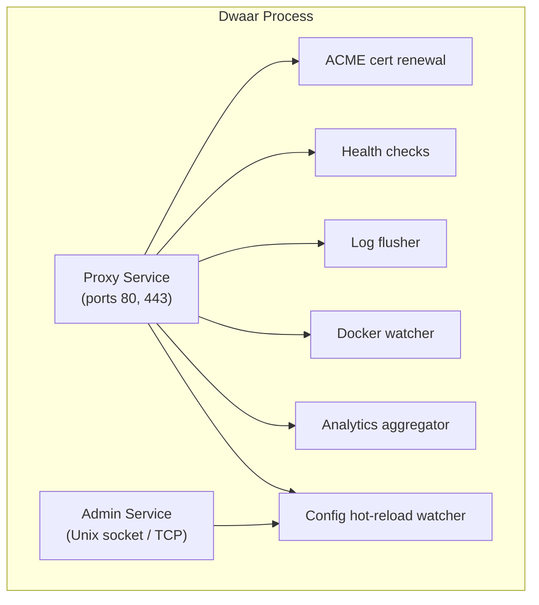
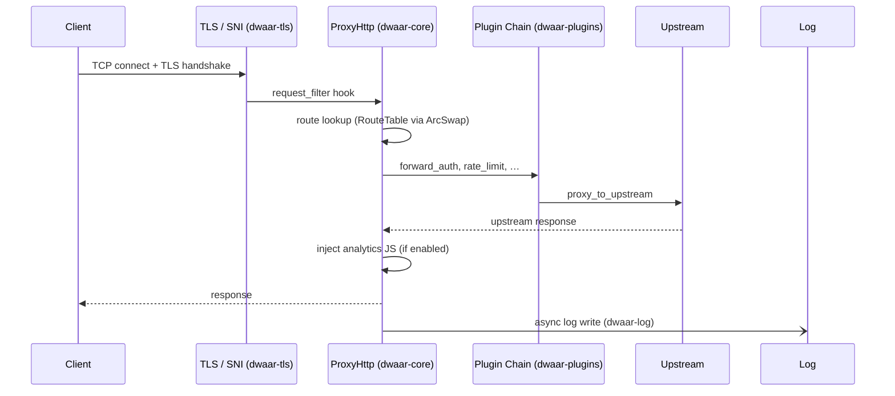

# Architecture Overview

> For a detailed technical architecture, see [ARCHITECTURE.md](https://github.com/permanu/Dwaar/blob/main/ARCHITECTURE.md) in the repository.

Dwaar is a single Rust binary built on Cloudflare Pingora. It runs as one OS process with multiple internal services coordinated by Pingora's server loop.

## Process Model

Each service and background task runs on its own Tokio runtime (thread pool). Background services are registered before `run_forever()` and communicate via channels — never via `tokio::spawn` at request time.

## Request Flow

## Crate Structure

| Crate | Purpose |
|-------|---------|
| `dwaar-ingress` | Binary entry point, CLI, Pingora server bootstrap |
| `dwaar-cli` | CLI argument parsing and config path resolution |
| `dwaar-core` | `ProxyHttp` implementation, route table, request context, file server, FastCGI, QUIC |
| `dwaar-config` | Dwaarfile tokenizer, parser, validator, hot-reload watcher |
| `dwaar-tls` | ACME client, certificate store, SNI routing |
| `dwaar-analytics` | JS injection, beacon ingestion, in-memory aggregation, Prometheus metrics |
| `dwaar-plugins` | `DwaarPlugin` trait, built-in plugins (rate-limit, forward-auth) |
| `dwaar-admin` | Admin HTTP API service (reload, status, metrics) |
| `dwaar-docker` | Docker label discovery and dynamic route registration |
| `dwaar-geo` | MaxMind GeoIP lookup |
| `dwaar-log` | Structured request logging, async batch writer |

## Key Design Principles

- **Lock-free config reads.** The live `RouteTable` is stored behind an `ArcSwap`. Reloads swap the pointer atomically; request threads never block on a mutex.
- **No allocation on the hot path.** Route matching works on borrowed request data; heap allocation is deferred until a route is selected.
- **Background services, not spawned tasks.** All async work that outlives a single request is a Pingora `BackgroundService`, not a `tokio::spawn`.
- **Plugin composability.** Every middleware is a `DwaarPlugin` — a single async trait with typed `RequestContext`. Plugins are chained at compile time per route.

See [Request Lifecycle](request-lifecycle.md) and [Crate Map](crate-map.md) for deeper detail.
