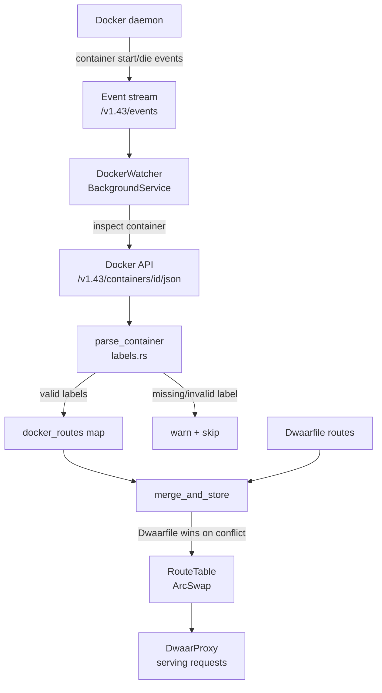

# Docker Label Discovery

Dwaar can auto-discover backends directly from running Docker containers. Add `dwaar.*` labels to any container and Dwaar registers a route for it — no Dwaarfile edits, no reloads, no restarts.

Label discovery runs as a background service. It bootstraps all running containers at startup, then streams Docker events to add routes when containers start and remove them when containers stop.

Dwaarfile routes always win. If a container claims a domain that is already defined in the Dwaarfile, the Dwaarfile entry is kept and a warning is logged.

## Quick Start

Start Dwaar with the Docker socket:

```bash
dwaar --docker-socket
```

This uses the default socket path `/var/run/docker.sock`. To use a custom path:

```bash
dwaar --docker-socket /run/user/1000/docker.sock
```

Label any container you want Dwaar to proxy:

```bash
docker run -d \
  --label dwaar.domain=api.example.com \
  --label dwaar.port=8080 \
  myapp/api:latest
```

Dwaar detects the new container, resolves its bridge network IP, and starts forwarding `api.example.com` requests to it immediately.

## How It Works



On startup, `DockerWatcher` calls `GET /v1.43/containers/json?filters=...` to list all running containers that have a `dwaar.domain` label, inspects each one, and populates the route table. It then opens a long-lived chunked stream from `GET /v1.43/events` filtered to `start` and `die` actions on containers.

When a `start` event arrives, the watcher inspects the new container, parses its labels, and — if valid — adds a route. When a `die` event arrives, the route is removed by container ID. After every change, the watcher merges Docker routes with the current Dwaarfile routes and atomically swaps the route table.

The client talks to the Docker Engine API over a Unix socket using hand-written HTTP/1.1. No Bollard, no Hyper — just `tokio::net::UnixStream`. If the connection drops, the watcher reconnects with exponential backoff (1 s → 30 s, ±500 ms jitter) without dropping existing routes.

## Supported Labels

| Label | Required | Type | Description | Example |
|---|---|---|---|---|
| `dwaar.domain` | Yes | string | Hostname to route traffic to this container. Must be a valid domain name. | `api.example.com` |
| `dwaar.port` | Yes | integer | Port the container listens on. Must be 1–65535. | `8080` |
| `dwaar.tls` | No | `"true"` / `"false"` | Connect to the upstream over TLS. Default: `false`. | `"true"` |
| `dwaar.rate_limit` | No | integer | Requests per second cap for this domain. Must be greater than 0. | `100` |

Labels not in this table are ignored. A container with a valid `dwaar.domain` but an invalid or missing `dwaar.port` is skipped with a warning logged at `WARN` level — it does not crash the watcher or affect other routes.

**Validation rules:**

- `dwaar.domain` must pass `is_valid_domain` — path traversal strings like `../etc/shadow` are rejected.
- `dwaar.port` must parse as a `u16` strictly greater than zero. Port 0 is rejected. Values above 65535 are rejected.
- Containers on host networking or with loopback/link-local IPs (`127.0.0.0/8`, `169.254.0.0/16`, `::1`, `fe80::/10`) are rejected. Host-networked containers are not routable from the proxy network.

## Docker Socket

By default, `--docker-socket` uses `/var/run/docker.sock`. Pass a custom path to use rootless Docker or a Docker-compatible runtime:

```bash
# Rootless Docker (per-user socket)
dwaar --docker-socket /run/user/1000/docker.sock

# Podman with Docker-compatible API
dwaar --docker-socket /run/user/1000/podman/podman.sock
```

**Security implications:**

The Docker socket grants root-equivalent access to the host. In containers, mount it read-only and restrict access with a dedicated group:

```yaml
volumes:
  - /var/run/docker.sock:/var/run/docker.sock:ro
```

Consider using a socket proxy such as [Tecnativa/docker-socket-proxy](https://github.com/Tecnativa/docker-socket-proxy) to restrict which Docker API endpoints Dwaar can reach. Dwaar only calls:

- `GET /v1.43/containers/json` (list containers)
- `GET /v1.43/containers/{id}/json` (inspect container)
- `GET /v1.43/events` (event stream)

## Container Lifecycle

| Event | What Dwaar does |
|---|---|
| Dwaar starts | Bootstraps all running containers with `dwaar.domain` label; populates route table. |
| Container starts (`start` event) | Inspects container, parses labels. If valid, adds route and re-merges table. |
| Container stops or crashes (`die` event) | Removes route by container ID. Re-merges table. |
| Container has no valid labels | Skipped silently at `DEBUG` level (no `dwaar.domain` present) or at `WARN` level (label present but invalid). |
| Two containers claim the same domain | First-seen wins. Second container is skipped with a `WARN` log. |
| Dwaarfile defines the same domain | Dwaarfile wins. Docker route is shadowed with a `WARN` log. |
| Docker socket disconnects | Watcher reconnects with exponential backoff. Existing routes remain in the table during reconnection. |
| Dwaarfile reloaded | Watcher re-merges Dwaarfile routes with current Docker routes. No Docker reconnection needed. |

## Complete Example

```yaml
services:
  dwaar:
    image: ghcr.io/permanu/dwaar:latest
    restart: unless-stopped
    command: ["dwaar", "--docker-socket", "/var/run/docker.sock"]
    ports:
      - "80:80"
      - "443:443"
      - "443:443/udp"
    volumes:
      - ./Dwaarfile:/etc/dwaar/Dwaarfile:ro
      - ./certs:/etc/dwaar/certs:ro
      - /var/run/docker.sock:/var/run/docker.sock:ro
    environment:
      DWAAR_CONFIG: /etc/dwaar/Dwaarfile
      DWAAR_ADMIN_TOKEN: "${DWAAR_ADMIN_TOKEN}"

  api:
    image: myapp/api:latest
    expose:
      - "8080"
    labels:
      dwaar.domain: api.example.com
      dwaar.port: "8080"
      dwaar.rate_limit: "200"
    restart: unless-stopped

  web:
    image: myapp/web:latest
    expose:
      - "3000"
    labels:
      dwaar.domain: example.com
      dwaar.port: "3000"
    restart: unless-stopped

  admin:
    image: myapp/admin:latest
    expose:
      - "4000"
    labels:
      dwaar.domain: admin.example.com
      dwaar.port: "4000"
      dwaar.tls: "true"
      dwaar.rate_limit: "50"
    restart: unless-stopped
```

In this setup, the Dwaarfile only needs to configure TLS certificates. Routes themselves come entirely from container labels:

```
# Dwaarfile — TLS certs only; routes come from Docker labels
admin.example.com {
  tls /etc/dwaar/certs/admin.example.com.crt /etc/dwaar/certs/admin.example.com.key
}
```

Bring up new services by adding `dwaar.*` labels to their containers. Dwaar picks them up within seconds of container start.

## Related

- [Docker](docker.md) — running Dwaar itself in Docker, volume mounts, environment variables
- [Reverse Proxy](../features/reverse-proxy.md) — static upstream configuration via Dwaarfile
- [Admin API](../api/admin.md) — programmatic route management
