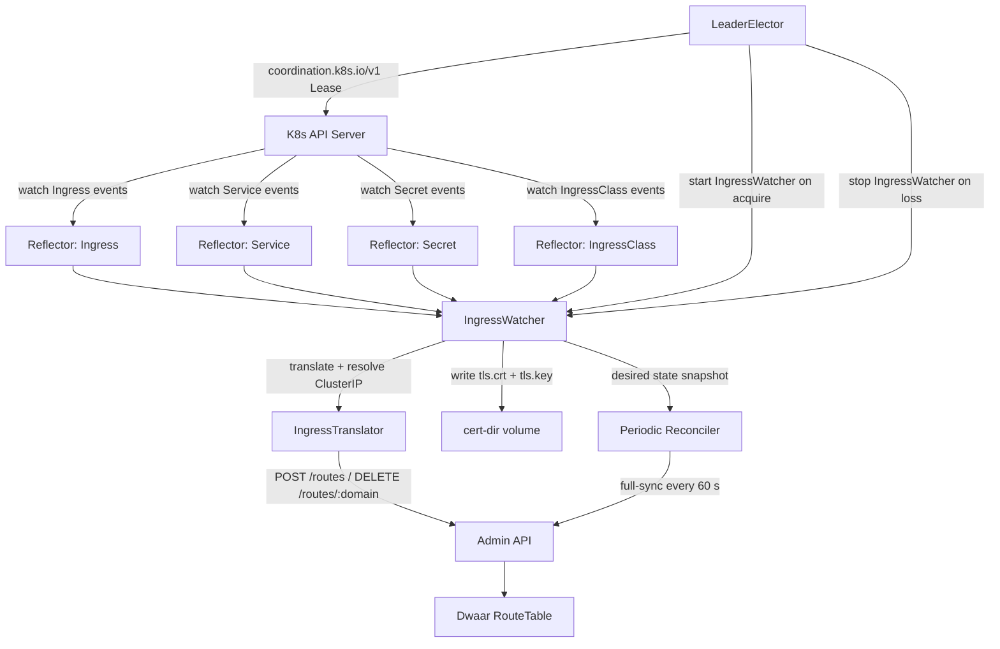

# Kubernetes Ingress Controller

`dwaar-ingress` is a standalone binary that watches Kubernetes Ingress, Service, and Secret resources and reconciles them into Dwaar's route table via the admin API. Deploy it alongside your Dwaar proxy pods; it requires no sidecar and carries a ~64 MiB memory footprint at rest.

Two replicas run by default. Leader election ensures exactly one replica drives route mutations at any time while the standby is ready to take over within seconds.

## Quick Start

```bash
helm install dwaar-ingress ./deploy/helm/dwaar-ingress \
  --namespace dwaar-system \
  --create-namespace \
  --set controller.adminUrl=http://dwaar-admin:9000
```

## Architecture



All four resource types are watched via `kube::runtime::reflector` — in-memory caches that receive change events from the API server. The `IngressWatcher` drives reconciliation events; the periodic reconciler runs a full-sync pass every 60 seconds to correct any drift from missed events or controller restarts.

The `IngressTranslator` maps each `spec.rules[].host` to a domain key and resolves the backend Service to a `ClusterIP:port` upstream using the local Service store — no API round-trip per reconcile event.

## Annotations

Add `dwaar.dev/*` annotations to any Ingress to override per-route behaviour. Unknown `dwaar.dev/*` annotations are logged as warnings and ignored; non-`dwaar.dev/*` annotations are never read.

| Annotation | Type | Description | Example |
|---|---|---|---|
| `dwaar.dev/rate-limit` | `u32` req/s | Apply rate limiting at the proxy. Zero disables. | `"500"` |
| `dwaar.dev/tls-redirect` | `bool` | Issue HTTP 301 → HTTPS for all plaintext requests on this Ingress. | `"true"` |
| `dwaar.dev/upstream-proto` | `"h2"` or `"http"` | Force a specific application protocol on the upstream connection. Omit to let Dwaar negotiate. | `"h2"` |
| `dwaar.dev/under-attack` | `bool` | Enable challenge / JavaScript proof-of-work mode before forwarding. | `"true"` |
| `dwaar.dev/ip-filter-allow` | CIDR list | Comma-separated allowlist. All IPs not in the list are denied. | `"10.0.0.0/8,172.16.0.0/12"` |
| `dwaar.dev/ip-filter-deny` | CIDR list | Comma-separated denylist. All IPs not in the list are allowed. | `"203.0.113.0/24"` |

**CIDR format:** `addr/prefix`. IPv4 prefix max is `/32`; IPv6 max is `/128`. Individual invalid entries are skipped with a warning — a single typo does not discard the rest of the list.

**Bool accepted values:** `true`, `1`, `yes` / `false`, `0`, `no` (case-insensitive).

**IngressClass filtering:** The controller only processes Ingresses whose `spec.ingressClassName` matches `--ingress-class`. When `--ingress-class` is unset, all Ingresses are processed. The legacy `kubernetes.io/ingress.class` annotation is also checked as a fallback when `spec.ingressClassName` is absent.

## Leader Election

When `replicaCount` is greater than one, every replica runs the leader election loop. Only the current leader starts the `IngressWatcher` and drives route mutations.

The protocol uses `coordination.k8s.io/v1` Lease objects:

1. **Candidate** — attempt to `CREATE` the Lease with `holderIdentity` set to the pod hostname. A `409 Conflict` means another pod holds it; enter observer mode.
2. **Leader** — renew `renewTime` on the Lease every `renew_deadline` (default 10 s). If renewal fails or returns `409`, immediately drop to Candidate and signal the watcher to stop.
3. **Observer** — poll every `retry_period` (default 2 s). If `renewTime` is older than `lease_duration` (default 15 s), the current holder is presumed dead; attempt acquisition via strategic merge patch with the stored `resourceVersion` to win concurrent races safely.

The `leader_ready` and `sync_ready` health flags both clear on leadership loss. The standby replica does not report `/readyz` true until it acquires the lease and completes a fresh informer sync.

| Parameter | Default | CLI flag | Env var |
|---|---|---|---|
| Lease name | `dwaar-ingress-leader` | `--lease-name` | `LEASE_NAME` |
| Lease namespace | `kube-system` | `--lease-namespace` | `LEASE_NAMESPACE` |
| Lease duration | 15 s | — | — |
| Renew deadline | 10 s | — | — |
| Retry period | 2 s | — | — |

## TLS Secrets

Reference a Kubernetes TLS Secret from an Ingress `spec.tls` block:

```yaml
spec:
  tls:
    - hosts:
        - app.example.com
      secretName: app-tls-secret
```

When the watcher processes the Ingress, it reads `tls.crt` and `tls.key` from the Secret's binary data and writes them to `cert-dir` as:

```
{namespace}_{secret_name}.crt   # mode 0644
{namespace}_{secret_name}.key   # mode 0600
```

For example, Secret `app-tls-secret` in namespace `production` becomes:

```
/var/lib/dwaar-ingress/certs/production_app-tls-secret.crt
/var/lib/dwaar-ingress/certs/production_app-tls-secret.key
```

Namespace and secret name components are validated before any filesystem operation — segments containing `/`, `\`, null bytes, or `..` are rejected to prevent path traversal. When an Ingress is deleted its PEM files are removed from disk.

Configure `cert-dir` so Dwaar can read the files. Point Dwaar's TLS configuration at the same directory or mount the same volume.

## CLI Flags

Every flag also has an environment variable equivalent (shown in the `Env var` column).

| Flag | Env var | Default | Description |
|---|---|---|---|
| `--admin-url` | `DWAAR_ADMIN_URL` | `http://127.0.0.1:6190` | Dwaar admin API base URL. |
| `--admin-token` | `DWAAR_ADMIN_TOKEN` | _(none)_ | Bearer token for admin API authentication. |
| `--health-addr` | `HEALTH_ADDR` | `0.0.0.0:8080` | Address for `/healthz` and `/readyz` endpoints. |
| `--ingress-class` | `INGRESS_CLASS` | _(none — manage all)_ | Only manage Ingresses with this IngressClass name. |
| `--namespace` | `WATCH_NAMESPACE` | _(none — all namespaces)_ | Restrict watching to a single namespace. |
| `--lease-name` | `LEASE_NAME` | `dwaar-ingress-leader` | Name of the leader election Lease object. |
| `--lease-namespace` | `LEASE_NAMESPACE` | `kube-system` | Namespace that holds the Lease object. |
| `--cert-dir` | `CERT_DIR` | `/var/lib/dwaar-ingress/certs` | Directory where TLS PEM files are written. |

## Complete Example

```yaml
apiVersion: networking.k8s.io/v1
kind: Ingress
metadata:
  name: my-app
  namespace: production
  annotations:
    dwaar.dev/tls-redirect: "true"
    dwaar.dev/rate-limit: "300"
    dwaar.dev/upstream-proto: "h2"
    dwaar.dev/ip-filter-deny: "203.0.113.0/24,198.51.100.0/24"
spec:
  ingressClassName: dwaar
  tls:
    - hosts:
        - app.example.com
      secretName: app-tls-secret
  rules:
    - host: app.example.com
      http:
        paths:
          - path: /api/
            pathType: Prefix
            backend:
              service:
                name: api-service
                port:
                  number: 8080
          - path: /
            pathType: Prefix
            backend:
              service:
                name: frontend-service
                port:
                  number: 3000
```

This Ingress produces two routes in the Dwaar route table:

- `app.example.com/api/` → `ClusterIP:8080`, TLS termination enabled
- `app.example.com` → `ClusterIP:3000`, TLS termination enabled

Both routes receive the rate limit (300 req/s), HTTP→HTTPS redirect, forced HTTP/2 upstream, and the two denied CIDR blocks.

## Related

- [Helm Chart](helm.md) — deploy `dwaar-ingress` via Helm with all values documented
- [Automatic HTTPS](../automatic-https.md) — how Dwaar manages TLS certificates
- [Reverse Proxy](../reverse-proxy.md) — the core proxy behaviour that ingress routes target
