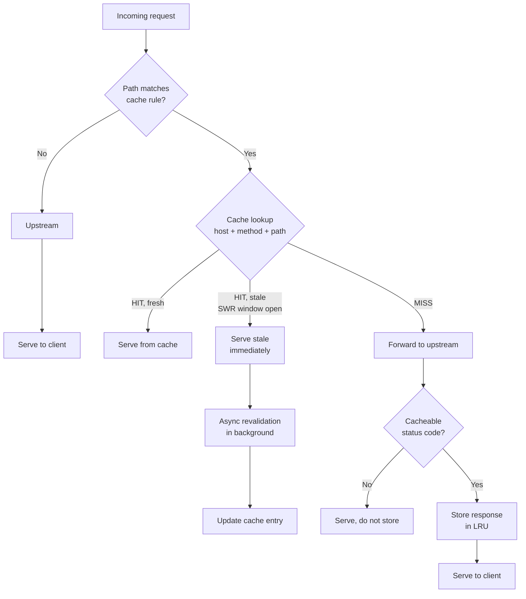

# HTTP Caching

Dwaar caches upstream responses in an in-process LRU store backed by
[pingora-cache](https://github.com/cloudflare/pingora). Responses satisfying
path rules are stored after the first upstream fetch and served from memory
on subsequent requests — no external cache daemon required.

Cached by default: `200 OK`, `301 Moved Permanently`, `308 Permanent Redirect`,
and `404 Not Found`. All other status codes pass through uncached unless the
origin sends an explicit `Cache-Control: public` header.

---

## Quick Start

```caddyfile
example.com {
    reverse_proxy :3000

    cache {
        match_path /static/*
    }
}
```

All requests whose path starts with `/static/` are cached. Every other path
bypasses the cache entirely.

---

## How It Works



**Stampede protection.** When multiple concurrent requests miss the same key,
Pingora's `CacheLock` allows only one request to fetch from the upstream.
The rest wait up to 10 seconds for the result, then proceed normally if the
lock holder times out.

**Stale-while-revalidate.** While a stale entry is within the
`stale_while_revalidate` window, Dwaar serves the cached copy immediately and
kicks off an upstream fetch in the background. The client sees no added latency.

---

## Configuration

Place a `cache` block inside a site block. All fields are optional; omitting
a field applies the default shown below.

```caddyfile
example.com {
    reverse_proxy :3000

    cache {
        max_size          1g
        match_path        /static/* /assets/*
        default_ttl       3600
        stale_while_revalidate 60
    }
}
```

| Option                  | Type             | Default | Description                                                                                              |
|-------------------------|------------------|---------|----------------------------------------------------------------------------------------------------------|
| `max_size`              | bytes (`1g`, `512m`, raw integer) | `1073741824` (1 GiB) | LRU eviction budget. When the store exceeds this limit, the least-recently-used entries are evicted first. |
| `match_path`            | space-separated path patterns | *(all paths)* | Paths eligible for caching. Patterns ending in `*` are prefix matches; all others are exact. An empty value caches every path on the site. |
| `default_ttl`           | seconds          | `3600`  | Freshness TTL applied when the upstream sends no `Cache-Control` header. Per-response `Cache-Control: max-age` values always take precedence. |
| `stale_while_revalidate`| seconds          | `60`    | How long after expiry a stale entry may be served to the client while a background revalidation is in progress. Also used as the `stale-if-error` window. |

---

## Cache Keys

Each cache entry is keyed on three components assembled by `build_cache_key`
in `crates/dwaar-core/src/cache.rs`:

| Component | Source                    | Purpose                                                      |
|-----------|---------------------------|--------------------------------------------------------------|
| Namespace | `Host` header value       | Isolates entries per virtual host — `site-a.com/index.html` and `site-b.com/index.html` are separate entries. |
| Primary   | `METHOD path?query`       | Differentiates GET vs HEAD and includes the full path and query string. |
| Vary      | *(empty string)*          | `Vary`-based splitting is not yet implemented; all variants of a URL share one entry. |

Query strings are part of the key. `/search?q=foo` and `/search?q=bar` are
stored and evicted independently.

---

## Cache Purge

Purge a single entry via the Admin API:

```
PURGE /cache/{host}/{path}
```

**Example:**

```sh
curl -X PURGE http://localhost:2019/cache/example.com/static/style.css
```

A `200` response with `{"purged":true}` confirms the entry was removed.
A `404` with `{"purged":false,"reason":"not found"}` means the key was not
in the store (already expired or never cached).

See [Admin API — Cache Purge](../api/cache-purge.md) for the full endpoint
reference including bulk purge patterns.

---

## Complete Example

```caddyfile
example.com {
    # Upstream application server
    reverse_proxy :8080

    # Cache static assets aggressively; short TTL for API responses
    cache {
        max_size               512m
        match_path             /static/* /assets/* /favicon.ico
        default_ttl            86400
        stale_while_revalidate 300
    }

    # Compress cached and uncached responses alike
    encode gzip br
}
```

With this configuration:

- Requests under `/static/`, `/assets/`, or exactly `/favicon.ico` are cached
  for up to 24 hours (or as long as the origin's `Cache-Control` says).
- During the 5-minute stale-while-revalidate window, clients receive the old
  version while Dwaar refreshes silently in the background.
- The LRU budget is capped at 512 MiB; the process consumes no more than that
  for the cache store regardless of origin traffic volume.
- `gzip` and Brotli encoding apply to responses served from cache and from
  the upstream alike.

---

## Related

- [Compression](./compression.md) — `encode` directive for on-the-fly gzip and Brotli
- [Admin API — Cache Purge](../api/cache-purge.md) — programmatic cache invalidation
- [Load Balancing](./load-balancing.md) — distribute upstream connections behind a cache
- [Global Options](../configuration/global-options.md) — process-wide settings
