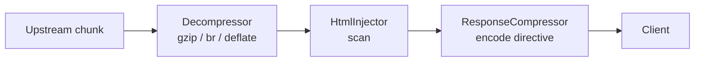

# Compression

Dwaar compresses response bodies on the fly using gzip, brotli, or zstd. The
algorithm is chosen per-request by negotiating with the client's
`Accept-Encoding` header against the encodings you list in `encode`. Only
compressible content types (HTML, CSS, JS, JSON, SVG, WASM, plain text, XML)
are compressed. Binary formats that are already compressed (images, video,
fonts) and gRPC payloads are passed through unchanged. Responses smaller than
1 024 bytes are also skipped — compression overhead would increase their size.

## Quick Start

```
example.com {
    reverse_proxy localhost:3000
    encode gzip zstd br
}
```

List the algorithms you want to offer. Dwaar applies them in the order that
best satisfies the client's `Accept-Encoding` header, not the order you wrote
them.

## How It Works

When Dwaar receives a response from the upstream:

1. `Content-Type` is checked against the compressible type list.
2. `Content-Encoding` is checked — if the response is already encoded,
   compression is skipped to avoid double-encoding.
3. `Content-Length` (if present) is checked against the 1 024-byte minimum.
4. The `Accept-Encoding` header (captured at request time) is parsed and the
   best matching algorithm is selected.
5. A `ResponseCompressor` is created and stored in the request context.
6. `Content-Encoding` is set on the response and `Content-Length` is removed
   (the compressed size is unknown before streaming).
7. Each response body chunk is fed through the compressor as it arrives from
   upstream. The final chunk triggers a finalize flush.

Compression runs at plugin priority 90, which means it executes after analytics
injection. The full body pipeline for an HTML response with both features active
is:

```
upstream chunk → decompress (if encoded) → inject analytics → compress → client
```

## Supported Algorithms

| Algorithm | Directive name | Level | Typical ratio (HTML) | CPU cost |
|---|---|---|---|---|
| Brotli | `br` | 4 (of 11) | 70–80% reduction | Medium |
| Gzip | `gzip` | fast (level 1) | 65–75% reduction | Low |
| Zstd | `zstd` | 3 (of 22) | 65–75% reduction | Low |

**Brotli** achieves roughly 20% better compression than gzip at the levels
Dwaar uses. It is selected first whenever the client supports it.

**Gzip** has universal browser support and is the safe default for any client
without explicit brotli support.

**Zstd** is fast and produces ratios comparable to gzip. Browser support
requires Chrome 123+, Firefox 126+, or Safari 17.4+. Use it as a complement to
gzip and brotli, not a replacement.

## Configuration

```
encode <algorithm> [algorithm ...]
```

List one or more algorithms. Valid tokens are `gzip`, `zstd`, and `br`.

```
# Brotli only
encode br

# Gzip and zstd (no brotli)
encode gzip zstd

# All three — Dwaar picks the best per client
encode gzip zstd br
```

The order you write them does not set the server preference. Dwaar's internal
priority is always brotli > gzip > zstd, modified by the client's `q` values.

## Content Negotiation

Dwaar parses `Accept-Encoding` per RFC 9110 §12.5.3:

- Each token may carry a `q` weight (`br;q=0.9, gzip;q=1.0`). Missing `q`
  defaults to 1.0.
- `q=0` explicitly disables that encoding for this request.
- A bare wildcard `*` is treated as accepting any encoding at the stated quality.
  `Accept-Encoding: *` resolves to brotli (the highest-priority encoding Dwaar
  supports).
- `x-gzip` is accepted as an alias for `gzip`.

**Selection algorithm:**

1. Parse all tokens and their `q` values.
2. From the configured encodings, keep only those the client accepts with `q > 0`.
3. Among the remaining candidates, pick the one with the highest client `q`
   value. On ties, Dwaar's internal priority wins (brotli > gzip > zstd).
4. If no match, no compression is applied and the response passes through.

**Examples:**

| `Accept-Encoding` | Configured | Selected |
|---|---|---|
| `gzip, br` | `gzip zstd br` | brotli (equal q, higher priority) |
| `br;q=0.5, gzip;q=1.0` | `gzip br` | gzip (client explicitly prefers it) |
| `gzip;q=0, br` | `gzip br` | brotli (gzip disabled by client) |
| `*` | `gzip br` | brotli (wildcard, highest priority wins) |
| `br;q=0, *` | `gzip br` | gzip (br excluded, wildcard covers gzip) |
| `compress, deflate` | `gzip br` | none (no match) |

## Interaction with Analytics

When analytics injection is active and the upstream sends a compressed HTML
response, Dwaar must decompress before injecting the script tag, then
recompress for the wire. The pipeline is:



The decompressor strips the upstream `Content-Encoding` header before the
plugin chain runs, so `CompressionPlugin` sees an unencoded response and applies
a fresh encoding based on `Accept-Encoding`. The recompressed output may use a
different algorithm than the upstream used — for example, an upstream that
returns gzip is recompressed with brotli if the client supports it and `encode
br` is configured.

If the upstream response is not compressed, the inject then compress path runs
without the decompression step.

The decompressor caps its input buffer at 10 MB and output at 100 MB per
response to guard against memory exhaustion and decompression bombs. On any
decompression error the raw bytes pass through and injection is skipped for that
response.

## Complete Example

```
example.com {
    reverse_proxy localhost:3000
    encode gzip zstd br
    tls auto
    header Cache-Control "no-store"
}

static.example.com {
    file_server /var/www/static
    encode gzip br
    header Cache-Control "public, max-age=31536000, immutable"
}
```

`example.com` offers all three encodings for the application server.
`static.example.com` omits zstd to target maximum browser compatibility for
cached assets served directly from disk.

## Related

- [First-Party Analytics](../observability/analytics.md) — how compression and
  analytics injection interact for compressed HTML responses
- [Load Balancing](./load-balancing.md) — upstream connection pooling and
  keepalive tuning
