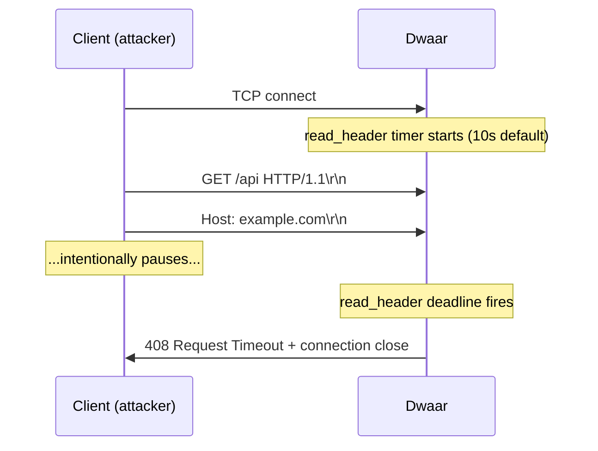

# Timeouts & Connection Draining

Unconfigured timeouts let attackers hold connections open indefinitely (slow loris) and leave in-flight requests orphaned during config reloads. Dwaar applies per-connection timeouts to every downstream session and drains in-flight requests gracefully before removing a route.

## Quick Start

```
{
    servers {
        timeouts {
            read_header  10s
            read_body    30s
            idle         60s
            max_requests 1000
        }
    }
    drain_timeout_secs 30
}
```

Add the `timeouts` block inside `servers { }` in the global options block. `drain_timeout_secs` sits directly in global options, outside `servers`.

## Timeout Configuration

All duration values accept an integer with a unit suffix: `s` (seconds), `m` (minutes), `h` (hours). Set a field to `0` to disable that timeout — not recommended in production.

| Field | Dwaarfile key | Default | Description |
|---|---|---|---|
| `header_secs` | `read_header` | `10s` | Maximum time to receive complete request headers after a TCP connection is accepted. Connections that have not finished sending headers by this deadline are closed with 408 Request Timeout. Handled by Pingora's `read_timeout` during the initial read phase. |
| `body_secs` | `read_body` | `30s` | Maximum time to receive the complete request body after headers have been read. Applied via `set_read_timeout` at the start of `request_filter`. Clients that open a connection and trickle body bytes trigger this deadline. |
| `keepalive_secs` | `idle` | `60s` | Maximum idle time on a keep-alive connection between requests. After this period of silence, Dwaar closes the connection. Applied via `set_keepalive`. |
| `max_requests` | `max_requests` | `1000` | Maximum number of requests served on a single keep-alive connection before Dwaar forces the client to open a new one. Maps to Pingora's `keepalive_request_limit`. |

## Slow Loris Protection

A slow loris attack works by opening many connections and sending request headers (or body bytes) as slowly as possible — never completing the request, never triggering a normal timeout. Without `read_header` and `read_body` deadlines, each of those connections holds a file descriptor and stack allocation until the server runs out of resources.

`read_header` terminates a connection the moment the header deadline expires. `read_body` does the same for the body phase. Together they cap the maximum duration a single client can hold a connection open during the request-receive phase.



For the body phase, the same mechanism applies. After Dwaar receives complete headers it resets the read deadline to `read_body` seconds. A client that sends `Content-Length: 1048576` and then stalls gets disconnected before it can exhaust upstream capacity.

> **Upstream timeouts** — `connection_timeout` (10 s) and `read_timeout` / `write_timeout` (30 s each) are applied to the upstream peer connection inside Dwaar and are not configurable through `timeouts { }`. They protect against slow or unresponsive backends.

## Connection Draining

When you reload a Dwaarfile that removes a route, Dwaar does not close existing connections abruptly. Instead it drains them:

1. The route is marked as draining. Any new request that resolves to a draining route receives a `502` immediately — new work is rejected.
2. Requests already in flight on that route continue to completion. Each request decrements an `active_connections` counter when it finishes logging.
3. After `drain_timeout_secs`, any connection still open is force-closed regardless of state.

```
{
    drain_timeout_secs 30
}
```

| Option | Type | Default | Description |
|---|---|---|---|
| `drain_timeout_secs` | integer | `30` | Seconds Dwaar waits for in-flight requests to finish on a removed route before force-closing connections. |

Set `drain_timeout_secs` high enough to cover your 99th-percentile request duration. For APIs with long-running streaming responses, raise it to match your maximum expected stream lifetime. Lowering it risks cutting responses in the middle of a body write.

## Keep-Alive Limits

`idle` and `max_requests` work together to bound the lifetime of a persistent connection.

- `idle` prevents connections that are open but silent from accumulating indefinitely. A browser that opens a connection and then navigates away is cleaned up after the idle window.
- `max_requests` prevents a single connection from living forever as long as it sends occasional requests. After `max_requests` requests, Dwaar adds `Connection: close` to the final response and closes the socket.

Use both to limit the blast radius of a keep-alive leak:

```
{
    servers {
        timeouts {
            idle         30s
            max_requests 500
        }
    }
}
```

Reducing `max_requests` forces clients to reconnect more often, which improves load distribution across upstream connection pools but adds TLS handshake overhead on reconnect. Values between 500 and 2000 suit most workloads.

## Complete Example

```
# ── Global options ─────────────────────────────────────────────────────────────
{
    email admin@example.com

    # Drain in-flight requests for up to 45 s when a route is removed.
    drain_timeout_secs 45

    servers {
        # Slow loris + idle connection protection
        timeouts {
            # Headers must arrive within 8 s of connection accept.
            read_header  8s
            # Body must complete within 60 s (large upload allowance).
            read_body    60s
            # Close idle keep-alive connections after 30 s.
            idle         30s
            # Force reconnect after 500 requests per connection.
            max_requests 500
        }
    }
}

# ── API service ────────────────────────────────────────────────────────────────
api.example.com {
    reverse_proxy localhost:3000
}

# ── Upload endpoint with extended body timeout ─────────────────────────────────
# (read_body covers the downstream side; upstream write_timeout is 30 s)
uploads.example.com {
    reverse_proxy localhost:4000
}
```

> **Note:** You cannot override `timeouts` on a per-site basis. The `servers { timeouts { … } }` block is global and applies to every downstream connection. If different sites need radically different timeout profiles, run separate Dwaar instances.

## Related

- [Global Options](../configuration/global-options.md) — all global options including `drain_timeout_secs` and `servers { }`
- [Reverse Proxy](../routing/reverse-proxy.md) — upstream connection options and health checks
- [Zero-Downtime Reloads](../deployment/zero-downtime.md) — how config reloads interact with connection draining
