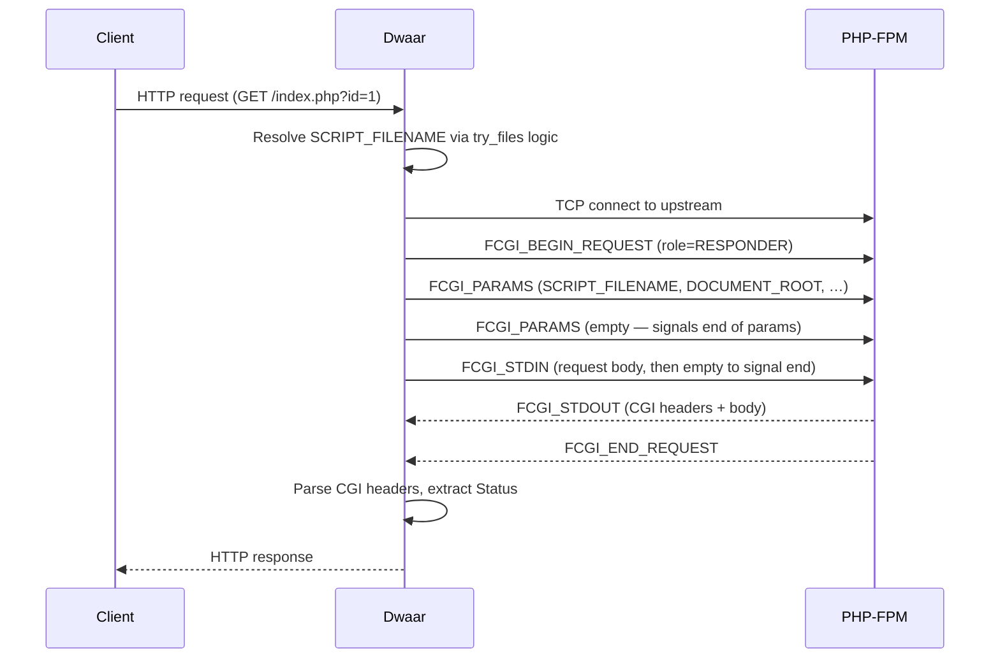

# FastCGI / PHP

Serve PHP applications via FastCGI (PHP-FPM) with a single directive. Dwaar implements the FastCGI protocol natively — no external crate, no subprocess — and constructs all required CGI environment variables automatically.

## Quick Start

```caddyfile
example.com {
    root * /var/www/html
    php_fastcgi localhost:9000
}
```

Point `php_fastcgi` at your PHP-FPM socket or TCP address. Dwaar handles the rest.

## How It Works



Dwaar speaks the FastCGI binary framing protocol directly: `BEGIN_REQUEST` → `PARAMS` → `STDIN` → read `STDOUT` → `END_REQUEST`. The CGI-style response (headers and body separated by `\r\n\r\n`) is parsed to extract the HTTP status code and response headers before forwarding to the client.

**Script resolution** follows Caddy's `try_files` semantics:

1. If the request path ends in `.php` and the file exists on disk, serve it directly.
2. Otherwise try `{path}/index.php` (directory index).
3. Fall back to `/index.php` in the root (catches Laravel, WordPress, and other front-controller frameworks).

**PATH_INFO splitting** — when the request path contains `.php` followed by a `/` boundary (e.g., `/app.php/resource/1`), Dwaar splits at the `.php` boundary and sets `SCRIPT_NAME` and `PATH_INFO` separately. It requires a true boundary character (`/` or `?`) to avoid matching `.phpx` or `.phpinfo`.

**Response cap** — PHP-FPM responses are capped at 10 MB. Larger responses return a 502.

**Timeout** — the FastCGI connection, each write, and each read operation are all individually bounded at 30 seconds.

## Configuration

### `php_fastcgi`

```caddyfile
php_fastcgi <address>
```

`<address>` is a TCP `host:port` or Unix socket path.

| Value | Example | Notes |
|-------|---------|-------|
| TCP address | `localhost:9000` | Default PHP-FPM port |
| TCP address | `127.0.0.1:9000` | Explicit loopback |
| Unix socket | `/run/php/php8.2-fpm.sock` | Lower overhead than TCP on the same host |

`php_fastcgi` requires `root` to be set in the same block. The root is used to construct `SCRIPT_FILENAME` and `DOCUMENT_ROOT`.

```caddyfile
example.com {
    root * /var/www/html
    php_fastcgi unix//run/php/php8.2-fpm.sock
}
```

## Environment Variables

Dwaar sends the following FastCGI parameters on every request:

| Parameter | Value | Notes |
|-----------|-------|-------|
| `SCRIPT_FILENAME` | `{root}/{script}` | Absolute path to the PHP file; resolved via try_files logic |
| `DOCUMENT_ROOT` | `{root}` | The configured `root` directory |
| `SCRIPT_NAME` | URL path up to `.php` boundary | Split from `PATH_INFO` when a boundary exists |
| `PATH_INFO` | Path after `.php/` boundary | Only set when a boundary is present |
| `REQUEST_METHOD` | `GET`, `POST`, etc. | From the incoming request |
| `REQUEST_URI` | `{path}?{query}` | Full URI including query string |
| `QUERY_STRING` | Query string | Empty string if none |
| `SERVER_NAME` | SNI hostname | From the `Host` header |
| `SERVER_PORT` | `443` or `80` | Based on whether TLS is active |
| `SERVER_PROTOCOL` | `HTTP/1.1` | Fixed |
| `GATEWAY_INTERFACE` | `CGI/1.1` | Fixed |
| `REMOTE_ADDR` | Client IP | From the connection |
| `CONTENT_LENGTH` | Request body length in bytes | `0` for bodyless requests |
| `CONTENT_TYPE` | `application/x-www-form-urlencoded` | Fixed for POST; PHP reads the actual body |

PHP-FPM uses `SCRIPT_FILENAME` (not `SCRIPT_NAME`) to find the file to execute. Ensure the path it resolves to is readable by the FPM worker process.

## Complete Example

A WordPress or Laravel site with PHP-FPM on a Unix socket:

```caddyfile
example.com {
    root * /var/www/html

    # Serve static assets directly — PHP doesn't need to handle these.
    @static {
        path *.css *.js *.png *.jpg *.jpeg *.gif *.webp *.svg *.ico *.woff *.woff2 *.ttf *.map
    }
    file_server @static

    # All other requests go to PHP-FPM.
    php_fastcgi unix//run/php/php8.3-fpm.sock

    # TLS via ACME
    tls contact@example.com
}
```

**What happens for `GET /wp-admin/edit.php?post=42`:**

1. The `@static` matcher does not match — Dwaar passes through to `php_fastcgi`.
2. Script resolution: `/var/www/html/wp-admin/edit.php` exists on disk — used as `SCRIPT_FILENAME`.
3. Dwaar connects to PHP-FPM, sends params including `SCRIPT_FILENAME=/var/www/html/wp-admin/edit.php` and `QUERY_STRING=post=42`.
4. PHP-FPM executes the script, returns a CGI response.
5. Dwaar parses the `Status` header (default 200 if absent), forwards the response to the browser.

**What happens for `GET /products/widget-blue`:**

1. Not a static extension — passes to `php_fastcgi`.
2. Script resolution: `/var/www/html/products/widget-blue` is not a `.php` file; `/var/www/html/products/widget-blue/index.php` doesn't exist; falls back to `/var/www/html/index.php`.
3. `SCRIPT_FILENAME=/var/www/html/index.php` — the front controller (Laravel/WordPress) handles routing.

## Related

- [File Server](./file-server.md) — serve static files without PHP
- [Reverse Proxy](./reverse-proxy.md) — proxy to HTTP backends instead of FastCGI
