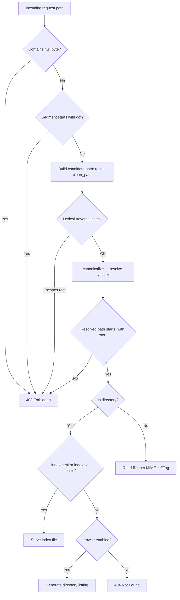

# File Server

Serve static files from disk with a two-line configuration. Dwaar's file server enforces path traversal protection, rejects dotfiles, and derives MIME types from extension — no client input touches the content-type logic.

## Quick Start

```caddyfile
example.com {
    root * /var/www
    file_server
}
```

`root` sets the filesystem base. `file_server` activates the handler. Every request path is resolved relative to that root.

## How It Works



**Path resolution** runs in two stages. First, a cheap lexical check walks the normalized path components — if a `..` segment would escape the root, the request is rejected before any syscall. Second, `canonicalize()` resolves symlinks; if the resolved path doesn't start with the configured root, the request is rejected. This catches symlinks that point outside the root tree.

**Index files** are tried in order: `index.html`, then `index.txt`. The first one that exists is served.

**MIME types** are derived solely from the file extension using a built-in table. The client's `Accept` header does not influence the content type.

**Cache headers** — Dwaar sets `Last-Modified` and `ETag` (derived from mtime + file size) on every served file. Browsers can use `If-None-Match` / `If-Modified-Since` to avoid re-downloading unchanged assets.

## Configuration

### `root`

```caddyfile
root [matcher] <path>
```

Sets the filesystem base directory. The path is canonicalized at config compile time, so symlinks in the root path itself are resolved once — not on every request.

| Field | Type | Description |
|-------|------|-------------|
| `path` | string | Absolute filesystem path (e.g., `/var/www/html`) |

Use a matcher to set different roots for different URL prefixes:

```caddyfile
root /api* /srv/api
root *    /var/www
```

### `file_server`

```caddyfile
file_server [browse]
```

| Option | Default | Description |
|--------|---------|-------------|
| _(none)_ | — | Serve files; return 404 for directories without an index file |
| `browse` | off | Enable directory listing when no index file exists |

**Security defaults** that cannot be disabled:

- Dotfiles (`.env`, `.htpasswd`, `.git/`) are always rejected with 403.
- Null bytes in the path are always rejected with 403.
- Path traversal (`../`) is rejected both lexically and after symlink resolution.

## try_files

`try_files` attempts a list of file paths in order and serves the first one that exists on disk. The last entry is used as a fallback regardless of whether it exists.

```caddyfile
example.com {
    root * /var/www
    try_files {path} /index.html
    file_server
}
```

Common patterns:

| Pattern | Use case |
|---------|----------|
| `try_files {path} /index.html` | SPA — fall through to index for client-side routing |
| `try_files {path}.html {path} /404.html` | Static site with clean URLs |
| `try_files {path} {path}/ =404` | Strict: 404 if neither file nor directory |

`{path}` expands to the URL path as received (after any rewrites). Patterns are matched against the filesystem relative to the configured `root`.

## Directory Browsing

Enable with `file_server browse`:

```caddyfile
example.com {
    root * /srv/files
    file_server browse
}
```

When a request targets a directory that has no `index.html` or `index.txt`, Dwaar generates an HTML listing:

- Entries are sorted alphabetically.
- Dotfiles are excluded from the listing (same rule as serving — they're invisible and unreachable).
- Directory entries show a trailing `/` and link to the subdirectory.
- A `../` parent link is included on all directories except the root.
- All filenames in the listing HTML are HTML-escaped to prevent XSS injection via crafted filenames.

The listing is generated entirely in memory as a single allocation; no template files are required.

## Complete Example

A single-page application with static assets and a `try_files` fallback so that client-side routes (e.g., `/about`, `/dashboard/settings`) are handled by `index.html`:

```caddyfile
app.example.com {
    root * /var/www/my-spa

    # Serve pre-existing files directly (JS, CSS, images, fonts, etc.).
    # Fall back to index.html for anything else so the SPA router takes over.
    try_files {path} /index.html

    file_server

    # Compress responses
    encode gzip
}
```

**What happens for `GET /dashboard/settings`:**

1. `try_files` checks whether `/var/www/my-spa/dashboard/settings` exists on disk — it doesn't.
2. Falls through to `/index.html` — Dwaar serves `/var/www/my-spa/index.html`.
3. The SPA boots in the browser and its router renders the settings page.

**What happens for `GET /assets/app.b3f1c2.js`:**

1. `try_files` checks `/var/www/my-spa/assets/app.b3f1c2.js` — it exists.
2. Dwaar serves it with `Content-Type: application/javascript; charset=utf-8` and an `ETag`.

## Related

- [Reverse Proxy](./reverse-proxy.md) — forward requests to a backend instead of serving from disk
- [Redirects & Rewrites](./redirects-rewrites.md) — rewrite URLs before `file_server` resolves paths
