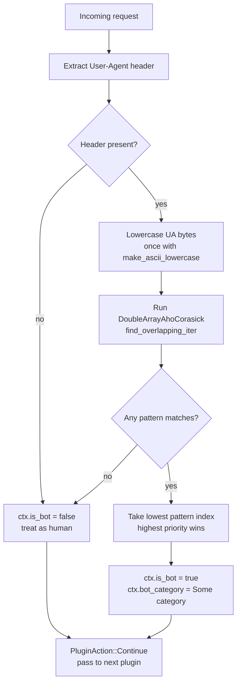

# Bot Detection

Dwaar classifies every incoming request's `User-Agent` header using Aho-Corasick multi-pattern matching. The automaton is built once at startup from 38 patterns across 5 categories and runs in **O(n)** time in the length of the User-Agent string — no backtracking, no regex engine overhead. The plugin runs at priority 10, before all other plugins, so downstream plugins (rate limiter, forward auth) can act on the classification result.

---

## Quick Start

Bot detection is **built in and always active**. You do not need any directive to enable it. Every request passing through Dwaar is automatically classified before it reaches your upstream.

```
api.example.com {
    reverse_proxy localhost:8080
}
```

That is all. The `is_bot` flag and `bot_category` are populated in the per-request context on every classified request and appear in your structured logs automatically.

---

## How It Works



The `BotDetector` is built from a compile-time pattern list using `daachorse::DoubleArrayAhoCorasick`. All patterns are pre-lowercased at build time; incoming User-Agent bytes are lowercased once before matching with `make_ascii_lowercase`, avoiding the UTF-8 re-validation cost of `str::to_ascii_lowercase` (User-Agent headers are always ASCII).

The automaton scans the UA string in a single forward pass using `find_overlapping_iter`. Because multiple patterns can match the same string, the plugin takes the match with the lowest pattern index — which corresponds to the highest-priority category. Malicious tool patterns are listed first in the pattern table, so a UA that contains both a scanner keyword and a search-engine keyword is always classified as `Malicious`.

Several patterns are **start-anchored**: `curl/`, `wget/`, `libwww`, and `php/` must appear at position 0 of the lowercased UA. This prevents false positives — for example, `something curl/7.0` does not match the `curl/` pattern, and `obscurlity` does not match it either.

An empty User-Agent is treated as human traffic. The plugin does not set `is_bot = true` for missing or empty UAs. If you want to apply a policy to empty UAs (e.g., block them at the edge), use the `ip_filter` or `rate_limit` directive independently.

---

## Bot Categories

| Category | Log value | Description | Example User-Agents |
|----------|-----------|-------------|---------------------|
| `Malicious` | `malicious` | Security scanners and exploit frameworks. Block or heavily rate-limit these. | `sqlmap/1.0-dev`, `Nikto/2.1.6`, `nuclei v2.9.0`, `masscan`, `zgrab`, `nmap`, `dirbuster`, `gobuster`, `wpscan` |
| `SearchEngine` | `search_engine` | Legitimate search and SEO crawlers. Worth allowing, but you may still want to rate-limit. | `Googlebot/2.1`, `bingbot/2.0`, `YandexBot/3.0`, `Baiduspider`, `DuckDuckBot`, `Yahoo! Slurp`, `Applebot`, `AhrefsBot`, `SemrushBot`, `MJ12bot` |
| `SocialCrawler` | `social_crawler` | Link-preview fetchers from social platforms. Generally benign — they inflate crawl counts in analytics. | `Twitterbot/1.0`, `facebookexternalhit/1.1`, `LinkedInBot/1.0`, `Slackbot`, `Discordbot`, `WhatsApp`, `TelegramBot` |
| `Monitoring` | `monitoring` | Uptime and availability checkers. Benign, but worth tagging separately for accurate analytics. | `UptimeRobot/2.0`, `Pingdom.com_bot`, `Site24x7`, `StatusCake`, `BetterUptime` |
| `Generic` | `generic` | Scripted HTTP clients without a specific product identity. May be automation, scrapers, or CI pipelines. | `curl/7.88.1`, `wget/1.21`, `python-requests/2.31`, `Go-http-client/2.0`, `libwww-perl/6.72`, `java/17`, `Scrapy/2.11`, `PHP/8.2.0` |

Priorities are applied in the order shown: `Malicious` beats all other categories. If a User-Agent string triggers patterns from two different categories, the classification with the higher priority (lower pattern index) wins.

---

## Integration with Logging

Every proxied request produces a structured JSON log entry. The bot detection result appears as the `is_bot` field:

```json
{
  "timestamp": "2026-04-05T12:00:00.000Z",
  "request_id": "01924f5c-7e2a-7d00-b3f4-deadbeef1234",
  "method": "GET",
  "path": "/api/products",
  "host": "api.example.com",
  "status": 200,
  "client_ip": "203.0.113.42",
  "user_agent": "sqlmap/1.0-dev",
  "is_bot": true,
  "response_time_us": 312,
  "upstream_addr": "127.0.0.1:8080"
}
```

The `is_bot` field is always present (never omitted). It is `true` for any classified bot and `false` for human traffic or unrecognised User-Agents.

The `bot_category` (e.g. `"malicious"`, `"search_engine"`) is available in the per-request plugin context (`PluginCtx`) for use by downstream plugins in the same request, but is not emitted as a separate field in the JSON log. To correlate category with requests, filter on `"is_bot": true` and cross-reference the `user_agent` field against the category table above.

If you ship logs to a structured aggregator (Elasticsearch, ClickHouse, Loki), index on `is_bot` to build dashboards separating bot and human traffic volumes, error rates, and latency distributions.

---

## Configuration

Bot detection has no Dwaarfile directive. It is a built-in plugin that runs unconditionally on every request. The overhead is negligible — a single O(n) scan over the User-Agent string — and the `is_bot` flag feeds other built-in plugins.

To take action based on bot classification, combine bot detection with these directives:

- **`rate_limit`** — apply a very low limit (e.g. `1/s`) so bots that exceed it receive a `429 Too Many Requests`.
- **`ip_filter`** — block known scanner IP ranges outright before the User-Agent is even inspected.
- **`forward_auth`** — delegate the allow/deny decision to your own service, which receives the request headers (including `User-Agent`) and can enforce its own policy.

---

## Complete Example

```
# Global config
{
    email admin@example.com
}

# Public website — bot traffic is logged but not blocked
www.example.com {
    reverse_proxy localhost:3000
    rate_limit 500/s
}

# API — rate limit applies to all traffic; bot detection tags every
# request in logs for downstream analytics and alerting
api.example.com {
    handle /v1/* {
        reverse_proxy localhost:8080
        rate_limit 100/s
    }
}

# Login endpoint — tight limit to slow credential stuffing regardless
# of whether the UA is classified as a bot
auth.example.com {
    handle /login {
        rate_limit 5/s
        reverse_proxy localhost:9000
    }

    handle {
        reverse_proxy localhost:9000
    }
}
```

Bot detection runs automatically on every site block above. The `is_bot` flag appears in all request logs. Build downstream policy — alerting, blocking, custom rate limits — against those logs without changing the Dwaarfile.

---

## Related

- [Rate Limiting](rate-limiting.md) — apply per-IP sliding-window limits; `BotDetectPlugin` runs first (priority 10) so the rate limiter can read the bot flag
- [IP Filtering](ip-filtering.md) — block or allow specific CIDR ranges before the request reaches the plugin chain
- [Logging](../observability/request-logging.md) — full reference for the structured JSON log format and all available fields
