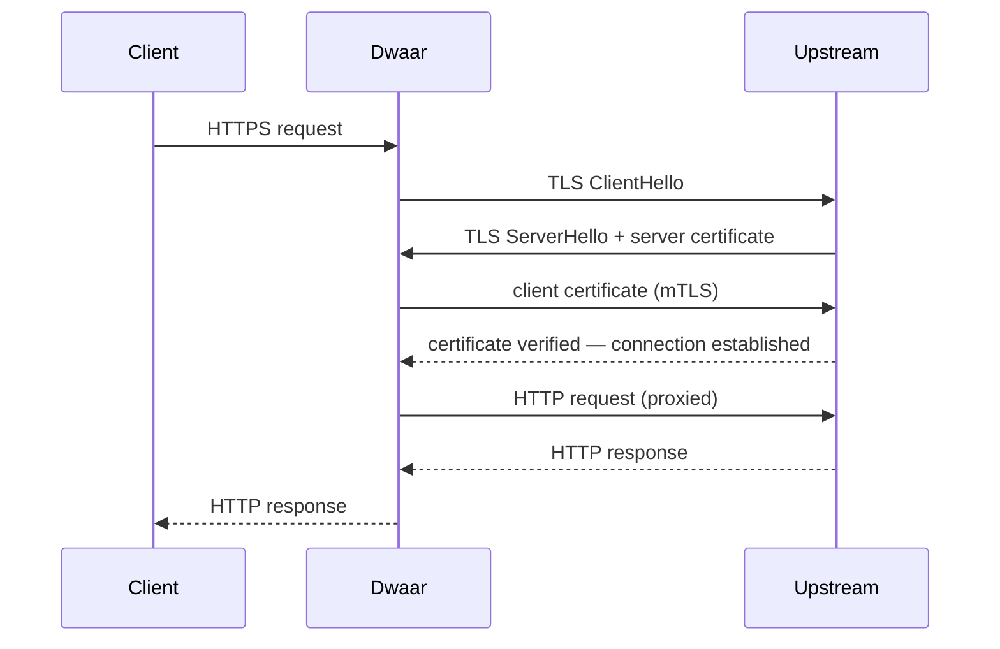

# Mutual TLS (mTLS)

Mutual TLS lets Dwaar authenticate itself to an upstream server by presenting a client certificate during the TLS handshake. The upstream verifies the certificate against a trusted CA before accepting the connection. Use this when your backends require proof that the caller is an authorised proxy — common in zero-trust networks, internal service meshes, and regulated environments.

Dwaar validates the cert/key pair at config load time: it checks that the private key matches the certificate's public key and logs a warning when the certificate is within 30 days of expiry.

---

## Quick Start

```caddy
api.example.com {
    reverse_proxy https://backend.internal:8443 {
        transport {
            tls_client_auth /etc/dwaar/certs/client.pem /etc/dwaar/certs/client.key
        }
    }
}
```

Dwaar connects to `backend.internal:8443` over TLS and presents `client.pem` + `client.key` during the handshake.

---

## How It Works



Standard TLS only flows left-to-right: the client validates the server. mTLS adds the return leg: the upstream also validates **Dwaar**. Both sides authenticate before any data flows.

Dwaar loads and validates the cert/key pair once at config compile time. The validated `CertKey` is then injected into every `HttpPeer` created for that upstream — there is no per-request file I/O.

---

## Configuration

Place a `transport { }` block inside `reverse_proxy` to configure upstream TLS behaviour.

```caddy
reverse_proxy https://backend.internal:9000 {
    transport {
        tls_client_auth <cert_path> <key_path>
        tls_trusted_ca_certs <ca_bundle_path>
        tls_server_name <sni_hostname>
    }
}
```

| Directive | Required | Description |
|---|---|---|
| `tls_client_auth <cert> <key>` | Yes (for mTLS) | PEM cert file and PEM private key file Dwaar presents to the upstream. Both must be on the local filesystem. |
| `tls_trusted_ca_certs <ca>` | No | PEM bundle of CA certificates used to verify the upstream's server certificate. Defaults to the system root CA store. |
| `tls_server_name <name>` | No | SNI hostname sent in the ClientHello. Defaults to the upstream hostname. Set this when the upstream's cert uses a different name than its address. |

Setting any `transport { }` TLS directive implicitly enables TLS for that upstream connection — you do not need a separate `tls` prefix.

### File Format Requirements

| File | Format | Notes |
|---|---|---|
| `<cert_path>` | PEM, one or more `CERTIFICATE` blocks | Include the full chain: leaf first, then intermediates. The leaf must match `<key_path>`. |
| `<key_path>` | PEM, single `PRIVATE KEY` block | Never logged — only the cert path appears in log output. |
| `<ca_bundle_path>` | PEM, one or more `CERTIFICATE` blocks | Concatenate multiple CA certs in one file if needed. |

Dwaar rejects mismatched cert/key pairs with an error at startup; the site is skipped if loading fails.

---

## Use Cases

**Zero-trust networking** — In a BeyondCorp-style network every service connection requires proof of identity. Issue a short-lived client certificate to each Dwaar instance from your internal PKI. Backends refuse connections from any caller that cannot present a valid certificate, so lateral movement from a compromised component is contained.

**Service mesh without a sidecar** — If you run service mesh policies at the proxy layer rather than via per-pod sidecars, configure each Dwaar instance with the mesh's issued client cert. Upstream services verify mesh membership by checking the certificate against the mesh CA.

**Microservice authentication** — Replace shared secrets or API keys with certificate-based authentication for internal service-to-service calls. Rotate credentials by issuing a new client certificate and hot-reloading the Dwaarfile — no deployment required.

**Regulatory compliance** — Some standards (PCI-DSS, HIPAA) require mutual authentication for connections carrying sensitive data. mTLS satisfies this requirement at the transport layer without application-level changes.

---

## Complete Example

```caddy
# Public HTTPS — clients use standard one-way TLS
api.example.com {
    tls /etc/dwaar/tls/api.pem /etc/dwaar/tls/api.key

    reverse_proxy https://payments.internal:8443 {
        transport {
            # Dwaar authenticates itself to the payments service
            tls_client_auth /etc/dwaar/mtls/client.pem /etc/dwaar/mtls/client.key

            # Verify the payments service's cert against the internal CA
            tls_trusted_ca_certs /etc/dwaar/mtls/internal-ca.pem

            # SNI differs from the upstream address
            tls_server_name payments.internal
        }

        health_uri /healthz
        health_interval 10
    }
}
```

The downstream connection (client → Dwaar) uses a manually provisioned certificate. The upstream connection (Dwaar → payments service) is separately secured with mTLS using certificates from the internal PKI.

---

## Related

- [Automatic HTTPS](automatic-https.md) — ACME-provisioned certificates for downstream connections
- [Manual Certificates](manual-certs.md) — Bring your own cert and key for the downstream listener
- [Reverse Proxy](../reverse-proxy.md) — Full reverse proxy configuration reference
