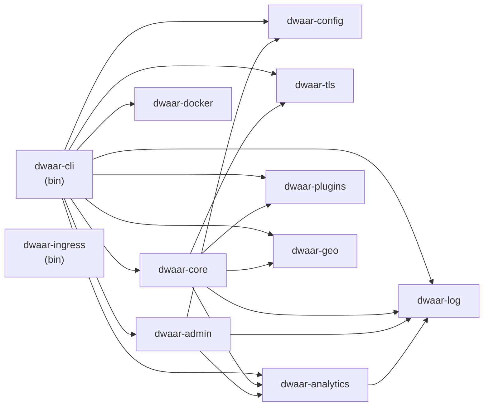

# Crate Map

Dwaar is organized as a Cargo workspace under `crates/`. Each crate has a single responsibility; `dwaar-cli` is the only entry point that wires them together.

## Dependency Graph

`dwaar-ingress` is an independent binary that talks to the Dwaar admin HTTP API over the network; it does not link any Dwaar library crates.

## Crate Descriptions

| Crate | Type | Description | Key Types |
|---|---|---|---|
| `dwaar-core` | lib | Core proxy engine — `ProxyHttp` implementation, route table, per-request context, cache, QUIC/H3 bridge with H2 upstream multiplexing, file server, FastCGI client | `DwaarProxy`, `RouteTable`, `Route`, `RequestContext`, `Handler`, `QuicService`, `BufferedConn`, `H2ConnPool` |
| `dwaar-config` | lib | Dwaarfile parser, AST model, config compiler, hot-reload watcher | `DwaarConfig`, `SiteBlock`, `Directive`, `ConfigWatcher`, `CompiledTlsConfig` |
| `dwaar-tls` | lib | TLS termination, SNI-based cert dispatch, ACME client (Let's Encrypt + Google Trust Services), OCSP stapling, mTLS | `SniResolver`, `CertStore`, `ChallengeSolver`, `CertIssuer`, `TlsBackgroundService` |
| `dwaar-analytics` | lib | First-party analytics — JS snippet, beacon collection, in-memory aggregation (HyperLogLog, t-digest, top-K), Prometheus metrics, HTML injector, decompressor | `AggregationService`, `AggEvent`, `AnalyticsSnapshot`, `HtmlInjector`, `PrometheusMetrics`, `RateCacheMetrics` |
| `dwaar-plugins` | lib | Plugin trait and chain, built-in plugins: bot detection (Aho-Corasick), rate limiting (token bucket), IP filter (CIDR trie), compression (gzip/br/zstd), security headers, under-attack mode, forward auth, WASM plugins | `DwaarPlugin`, `PluginChain`, `PluginCtx`, `BotDetector`, `RateLimiter`, `CompressionPlugin`, `WasmPlugin` |
| `dwaar-admin` | lib | Admin HTTP API service — route inspection, live metrics, config reload, health endpoint | `AdminService` |
| `dwaar-log` | lib | Structured request logging — `RequestLog` type, batch writer background service, stdout/file/unix-socket output destinations | `RequestLog`, `LogSender`, `LogReceiver`, `LogOutput`, `FileRotationWriter`, `UnixSocketWriter` |
| `dwaar-geo` | lib | GeoIP lookup — IP to country/city via memory-mapped MaxMind GeoLite2 database | `GeoLookup`, `CityResult` |
| `dwaar-docker` | lib | Docker socket watcher — discovers containers via labels, emits route add/remove events | `DockerClient`, `ContainerRoute` |
| `dwaar-cli` | bin | Process entry point — CLI argument parsing, Pingora service assembly, background service wiring, signal handling | `main` |
| `dwaar-ingress` | bin | Kubernetes ingress controller — watches `Ingress` resources via `kube-rs`, translates to Dwaar admin API calls | `main` |

## Binary Crates

### `dwaar-cli` — `crates/dwaar-cli/src/main.rs`

The only binary that links the full Dwaar library stack. Responsibilities:

- Parse CLI flags (`clap`) including `--config`, `--no-tls`, `--no-metrics`, `--no-cache`, `--h3`
- Compile the Dwaarfile via `dwaar-config` into a `RouteTable` and `CompiledTlsConfig`
- Build and register Pingora services: HTTP proxy, HTTPS proxy, QUIC listener (H3), admin API
- Wire background services: `TlsBackgroundService` (ACME renewal), `LogReceiver` (batch writer), `AggregationService` (analytics), `PrometheusMetrics` scrape endpoint
- Load optional subsystems: GeoIP database, Docker watcher, jemalloc allocator
- Call `server.run_forever()` to hand off control to Pingora's multi-threaded runtime

### `dwaar-ingress` — `crates/dwaar-ingress/src/main.rs`

A standalone Kubernetes controller. Does not link any Dwaar library crates. Responsibilities:

- Connect to the Kubernetes API server using in-cluster credentials (via `kube-rs`)
- Watch `Ingress` resources in the configured namespace using a reflector/watcher pattern
- Translate `Ingress` spec (host, paths, TLS secrets) into Dwaar admin API calls (`POST /admin/routes`, `DELETE /admin/routes/:domain`)
- Handle leader election so only one replica applies changes when running with multiple replicas
- Reconnect with exponential backoff on API server disconnects

## Related

- [Overview](../overview.md) — design goals and positioning
- [Request Lifecycle](./request-lifecycle.md) — how each crate participates in processing a request
