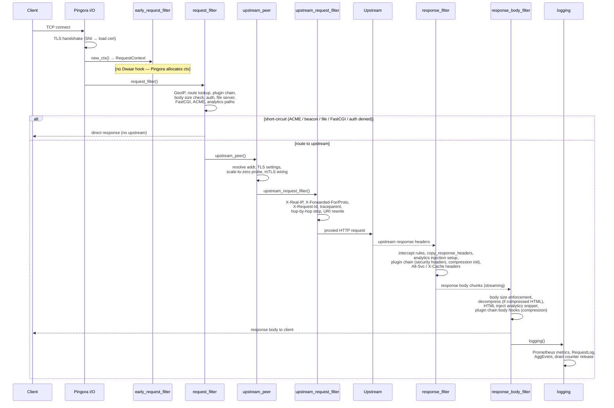

# Request Lifecycle

Every HTTP request passes through Pingora's `ProxyHttp` trait hooks in a fixed sequence. `DwaarProxy` implements each hook; feature-specific logic runs through the `PluginChain`. Understanding this pipeline tells you where to look when debugging latency, unexpected responses, or plugin interactions.

## Overview

## Phase Details

### `new_ctx` — Context Allocation

Pingora calls `new_ctx()` before the first hook. Dwaar allocates a `RequestContext` containing a UUID v7 request ID, a `start_time` instant, and zeroed `PluginCtx`. The request ID is stable across all hooks and appears in every log field and in `X-Request-Id` on both the upstream request and the downstream response.

### `request_filter` — The Main Gate

`request_filter` does the bulk of per-request work. It returns `Ok(true)` to short-circuit (respond directly) or `Ok(false)` to continue to the upstream.

**Slow-loris protection** — sets the downstream keepalive timeout and body read timeout from config before anything else.

**Identity population** — extracts client IP, TLS flag, GeoIP country, `Host` header, method, path, `Accept-Encoding`, and detects WebSocket (`Upgrade: websocket` + `Connection: upgrade`) and gRPC (`Content-Type: application/grpc*`).

**Route lookup** — loads the `RouteTable` via a single lock-free `ArcSwap` load and resolves the `Host` header to a `Route`. Draining routes (removed during hot-reload with in-flight requests) return 502 immediately. For matching routes, the handler blocks are evaluated:

| Handler | What happens |
|---|---|
| `ReverseProxy` | upstream `SocketAddr` cached in `ctx.route_upstream` |
| `ReverseProxyPool` | LB policy selects a backend; max-conns slot acquired (503 if full) |
| `FastCgi` | upstream addr + FCGI root cached; handled entirely in this hook |
| `FileServer` | root + browse flag cached; file served and hook returns |
| `StaticResponse` | status + body cached; response written and hook returns |

Path-based config (rewrites, `handle_path` prefix stripping, `map` variable evaluation, intercept rules, `copy_response_headers`, IP filter, body size limits, cache config) is all extracted from the single route load — no second `ArcSwap` load occurs anywhere in the pipeline (Guardrail #27).

**Prometheus connection tracking** — `connection_start()` increments the active-connection gauge for the domain.

**Request body size** — if `Content-Length` is known and exceeds the configured limit, returns 413 without reading the body.

**Plugin chain (request phase)** — calls `PluginChain::run_request()`, which runs bot detection, rate limiting, IP filtering, and under-attack mode in priority order. If any plugin returns a `PluginResponse`, the request is short-circuited with that status.

**Authentication** — basic auth (credential check, bcrypt verify) then forward auth (async subrequest to external service). On denial, returns 401/403. On forward auth allow, copies the auth service's response headers into `ctx.forward_auth_headers` for injection in `upstream_request_filter`.

**Internal paths** — after all guards pass:

| Path | Action |
|---|---|
| `/_dwaar/a.js` | serve the embedded analytics JS (memory, no disk I/O) |
| `/_dwaar/collect` POST | parse and enqueue beacon event; return 204 |
| `/.well-known/acme-challenge/<token>` | serve ACME HTTP-01 key authorization |

If none of the above short-circuits, the request proceeds to `upstream_peer`.

### `request_cache_filter` — Cache Enable

Called by Pingora after `request_filter`. If `ctx.cache_enabled` is true (set during route lookup for GET requests matching a `cache {}` block), attaches the shared `MemoryCache` backend to the session. Skipped for WebSocket, gRPC, and non-GET requests.

### `upstream_peer` — Upstream Selection

Reads the upstream `SocketAddr` already cached in `ctx.route_upstream`. Constructs an `HttpPeer` with:

- 10s connection timeout, 30s read/write timeout
- TCP keepalive probes (60s idle, 10s interval, 3 retries) to detect dead connections without waiting for the full read timeout
- 60s idle connection eviction (just under nginx's default 75s keepalive)
- mTLS client cert and custom CA bundle wired in if configured
- `ALPN::H2` forced for gRPC upstreams
- For pool-backed routes, TLS settings and SNI come from the matching backend entry

**Scale-to-zero** — if the pool has a `scale_to_zero` config, performs a 500ms TCP probe. On failure, calls `wake_and_wait()` to trigger the container start and blocks until the backend becomes reachable (returns 504 on wake timeout).

### `upstream_request_filter` — Proxy Header Injection

Runs after the connection to upstream is established but before the request is sent.

**Proxy headers added:**

| Header | Value |
|---|---|
| `X-Real-IP` | direct client IP (written to stack buffer, no heap allocation) |
| `X-Forwarded-For` | same IP — replaces any client-supplied value to prevent spoofing |
| `X-Forwarded-Proto` | `http` or `https` based on downstream TLS state |
| `X-Request-Id` | UUID v7 from `ctx` |
| `traceparent` | propagated from client if valid W3C trace context; otherwise freshly generated |
| `tracestate` | relayed from client unchanged if present |

**Headers stripped (hop-by-hop, RFC 7230 §6.1):** `Proxy-Connection`, `Proxy-Authenticate`, `Proxy-Authorization`, `TE`, `Trailer`, `Upgrade` (except on WebSocket upgrades).

**Security strips:** `Authorization` header removed when Dwaar handled basic auth (prevents credentials reaching upstream logs). Forward auth `copy_headers` fields are stripped from the client request before the auth service's values are injected, preventing client header injection (CVE-2026-30851 mitigation).

**URI rewrite** — if a rewrite rule or `handle_path` produced `ctx.effective_path`, the upstream request URI is replaced before the request is sent.

### `response_filter` — Response Header Processing

Runs on the upstream's response headers before they reach the client.

**Tracing** — injects `X-Request-Id` into the downstream response for client-side correlation.

**HTTP/3 advertisement** — injects `Alt-Svc: h3=":443"; ma=86400` when QUIC is enabled and the route uses `reverse_proxy` (file server and FastCGI routes are excluded since they are not yet served over H3).

**Cache status** — writes `X-Cache: HIT`, `X-Cache: MISS`, or `X-Cache: STALE` from `ctx.cache_status`.

**Intercept rules** — first matching `intercept` rule (matched by status code range) can replace the status code, add headers, and queue a body replacement in `ctx.intercept_body`.

**`copy_response_headers`** — strips `exclude` headers; if `include` is non-empty, removes all headers not in the include list (preserving essential framing headers).

**Response body size pre-check** — if `Content-Length` exceeds the configured limit, immediately rewrites the status to 502 and queues an error body.

**Analytics injection setup** — for 2xx HTML responses: if the upstream sends a compressed body (`Content-Encoding: gzip/br/zstd`), installs a `Decompressor` and removes `Content-Encoding` so the injected HTML is decompressed inline. Installs an `HtmlInjector` to append the analytics snippet. Removes `Content-Length` (body length changes after injection).

**Plugin chain (response phase)** — calls `PluginChain::run_response()`. Built-in plugins: security headers (`Strict-Transport-Security`, `X-Content-Type-Options`, `X-Frame-Options`, `Referrer-Policy`, `Permissions-Policy`, `Content-Security-Policy`), compression init (decides encoding from `Accept-Encoding`).

### `response_body_filter` — Body Processing

Called for each body chunk streamed from upstream.

**Body size accounting** — accumulates `ctx.response_body_sent`; aborts with 502 if the limit is exceeded mid-stream (handles chunked upstreams that don't declare `Content-Length`).

**5xx error body capture** — on upstream 5xx responses, captures up to 1 KB of the body into `ctx.upstream_error_body` for structured logging. Zero overhead on 2xx/3xx/4xx paths.

**Intercept body override** — if `ctx.intercept_body` is set (from `response_filter`), replaces the chunk and skips all remaining body processing.

**Analytics pipeline (in order):**
1. `Decompressor::decompress()` — inflate gzip/br/zstd if the upstream body was compressed
2. `HtmlInjector::process()` — stream-scan for `</body>` and splice in the analytics `<script>` tag
3. `PluginChain::run_body()` — compression plugin compresses the final body before sending to client

### `logging` — Cleanup and Metrics

Runs after every request, including errors.

**Connection slot release:**
- Decrements `route.active_connections` (drain counter) — `fetch_update` with `checked_sub` prevents u32 underflow
- Calls `pool.release_connection(addr)` to return the max-conns slot

**Prometheus** — calls `record_request()` with method, status, response time, bytes sent/received; calls `connection_end()`; increments cache hit/miss counters.

**`RequestLog` construction** — builds a zero-copy `RequestLog` struct:

| Field | Source |
|---|---|
| `timestamp` | `Utc::now()` |
| `request_id` | UUID v7 from `ctx` |
| `method`, `path`, `query` | split from `ctx.plugin_ctx.path` (move, no clone) |
| `host` | moved from `ctx.plugin_ctx.host` |
| `status` | from `session.response_written()` |
| `response_time_us` | `ctx.start_time.elapsed()` in microseconds |
| `client_ip`, `country` | from `ctx.plugin_ctx` |
| `user_agent`, `referer` | from downstream request headers |
| `bytes_sent`, `bytes_received` | from `session.body_bytes_sent/read()` |
| `tls_version` | from `session.downstream_session.digest()` |
| `http_version` | mapped to `&'static str` (no allocation) |
| `is_bot` | set by `BotDetectPlugin` in request phase |
| `upstream_addr` | formatted from `ctx.route_upstream` |
| `cache_status` | `HIT`/`MISS`/`STALE` from `ctx.cache_status` |
| `trace_id` | from W3C traceparent parsed or generated in `upstream_request_filter` |
| `upstream_error_body` | first 1 KB of 5xx body if captured |

The `RequestLog` is sent via `LogSender::send()` to the batch writer background service (non-blocking channel send; drops on overflow rather than blocking the proxy thread).

**`AggEvent`** — simultaneously sends a lightweight event to the `AggregationService` containing host, path, status, bytes, client IP, country, and referer for in-memory analytics aggregation.

## Error Handling

| Phase | Error | Result |
|---|---|---|
| `request_filter` | No route for `Host` | 502 — no upstream configured |
| `request_filter` | Route is draining | 502 — connection close |
| `request_filter` | `Content-Length` > limit | 413 — no body read |
| `request_filter` | Pool at `max_conns` | 503 with `Retry-After: 1` |
| `request_filter` | Plugin chain blocks request | Plugin-defined status (429, 403, etc.) |
| `request_filter` | Basic/forward auth denied | 401/403 |
| `request_filter` | Forward auth service error | 502 |
| `request_filter` | FastCGI error | 502 |
| `upstream_peer` | Scale-to-zero wake timeout | 504 |
| `upstream_peer` | No upstream in pool | 502 |
| `upstream_request_filter` | Invalid rewritten URI | 500 |
| `response_filter` | Upstream `Content-Length` > limit | 502 (rewrites status in place) |
| `response_body_filter` | Accumulated body > limit | 502 (aborts upstream connection) |
| `logging` | Log channel full | Silently dropped — proxy unaffected |

In all error cases `logging()` still runs: the drain counter and connection slot are always released, and Prometheus metrics are always recorded.

## Related

- [Overview](../overview.md) — what Dwaar is and its design goals
- [Performance](../performance.md) — benchmarks and hot-path analysis
- [Plugins](../features/plugins.md) — how to write and configure plugins
- [Crate Map](./crate-map.md) — which crate owns each phase
