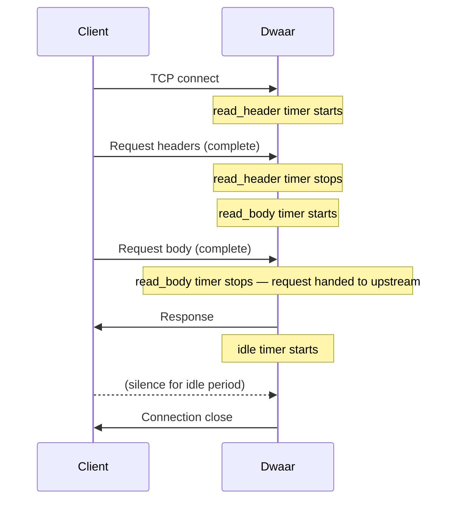

# Global Options

Global options control server-wide behaviour that is not tied to any one site — default ports, ACME email, HTTP/3, connection timeouts, and more. Place them in the bare `{ }` block at the very top of your Dwaarfile, before any site blocks. If the block is absent, Dwaar starts with the defaults shown in the reference tables below.

## Syntax

```
{
    http_port  80
    https_port 443
    email      admin@example.com

    servers {
        h3 on
        timeouts {
            read_body       30s
            read_header     10s
            write           0
            idle            60s
            max_requests    1000
        }
    }
}

example.com {
    reverse_proxy localhost:3000
}
```

The global options block has no label — it is the first `{ }` pair with no preceding address. Dwaar rejects a file where a labelled site block appears before the global block.

## Options Reference

| Option | Type | Default | Description |
|--------|------|---------|-------------|
| `http_port` | integer | `80` | TCP port Dwaar binds for plain-HTTP and ACME HTTP-01 challenge traffic. |
| `https_port` | integer | `443` | TCP port Dwaar binds for TLS (HTTP/1.1, HTTP/2, and HTTP/3 Alt-Svc). |
| `email` | string | — | Email address registered with the ACME provider (Let's Encrypt / ZeroSSL) for certificate issuance and expiry alerts. Required for automatic HTTPS. |
| `debug` | flag | `false` | Enables verbose debug logging. Write `debug` as a bare keyword with no value. Do not enable in production — output volume is high. |
| `auto_https` | string | — | Controls automatic HTTPS behaviour. `off` disables it entirely; `disable_redirects` issues certs but stops Dwaar from adding HTTP→HTTPS redirects. Omit to use the default (certs + redirects). |
| `drain_timeout_secs` | integer | `30` | Seconds Dwaar waits for in-flight requests to finish when a route is removed before force-closing connections. |
| `servers { h3 on }` | nested block | `off` | Enables HTTP/3 (QUIC). See [HTTP/3](#http3) below. |
| `servers { timeouts { … } }` | nested block | see Timeouts | Per-connection timeout settings. See [Timeouts](#timeouts) below. |

Options Dwaar recognises from a valid Caddyfile but has not yet implemented are stored as `passthrough` entries. Dwaar never errors on unrecognised Caddyfile syntax.

## Timeouts

Timeouts protect Dwaar against slow-loris attacks and idle-connection accumulation. Set them inside a `servers { timeouts { … } }` block.

```
{
    servers {
        timeouts {
            read_header  10s
            read_body    30s
            idle         60s
            max_requests 1000
        }
    }
}
```

| Field | Dwaarfile key | Default | Description |
|-------|--------------|---------|-------------|
| `header_secs` | `read_header` | `10` seconds | Maximum time to receive complete request headers on a fresh connection. Connections that have not finished sending headers by this deadline are closed with 408. |
| `body_secs` | `read_body` | `30` seconds | Maximum time to receive the complete request body after headers are read. Protects against clients that open a connection and trickle bytes. |
| `keepalive_secs` | `idle` | `60` seconds | Maximum idle time on a keep-alive connection between requests. After this period with no new request, Dwaar closes the connection. |
| `max_requests` | `max_requests` | `1000` | Maximum number of requests served on a single keep-alive connection before Dwaar forces the client to reconnect. Maps to Pingora's `keepalive_request_limit`. |

All duration fields accept an integer followed by a unit suffix: `s` (seconds), `m` (minutes), `h` (hours). Use `0` to disable a timeout entirely — not recommended in production.



## HTTP/3

Enable HTTP/3 (QUIC) by adding `h3 on` inside a `servers { }` block in global options:

```
{
    servers {
        h3 on
    }
}
```

When `h3 on` is set, Dwaar:

1. Binds a UDP listener on the same port as `https_port` (default 443).
2. Adds `Alt-Svc: h3=":443"; ma=2592000` to every HTTP/2 response so that browsers can upgrade on the next request.
3. Handles HTTP/3 connections through Pingora's QUIC transport — 0-RTT, stream multiplexing, and connection migration are all active automatically.

**Firewall note:** UDP port 443 must be open inbound. If your network or cloud security group blocks UDP 443, browsers will never complete the QUIC handshake and will fall back silently to HTTP/2 — no errors, just no HTTP/3 traffic.

```
{
    https_port 443
    servers {
        h3 on
    }
}

api.example.com {
    reverse_proxy localhost:3000
}
```

See [HTTP/3 performance tuning](../performance/http3.md) for UDP buffer sizing and OS-level tuning required to sustain high QUIC throughput.

## Complete Example

```
# ── Global options ────────────────────────────────────────────────────────────
{
    # Ports (change if running behind another listener on 80/443)
    http_port  80
    https_port 443

    # ACME email — required for automatic certificate issuance
    email ops@example.com

    # HTTP/3 via QUIC — requires UDP 443 open in your firewall
    servers {
        h3 on

        # Slow-loris and idle-connection protection
        timeouts {
            read_header  10s   # abort if headers not received within 10 s
            read_body    30s   # abort if body not received within 30 s
            idle         60s   # close idle keep-alive connections after 60 s
            max_requests 1000  # recycle connections after 1000 requests
        }
    }

    # Graceful drain: wait up to 45 s for in-flight requests on route removal
    drain_timeout_secs 45
}

# ── Site blocks follow ────────────────────────────────────────────────────────

api.example.com {
    reverse_proxy localhost:3000
}

www.example.com {
    reverse_proxy localhost:4000
}

# Internal admin panel — plain HTTP, no TLS
admin.internal:8080 {
    reverse_proxy localhost:9000
    tls off
}
```

## Related

- [Automatic HTTPS](../tls/automatic-https.md) — how `email` and `auto_https` control certificate provisioning and HTTP→HTTPS redirects.
- [HTTP/3 performance tuning](../performance/http3.md) — UDP buffer sizing, OS kernel settings, and measuring QUIC adoption.
- [Timeouts in depth](../performance/timeouts.md) — how `read_header`, `read_body`, and `idle` map to Pingora's session API, and how to diagnose timeout-related 408/504 errors.
