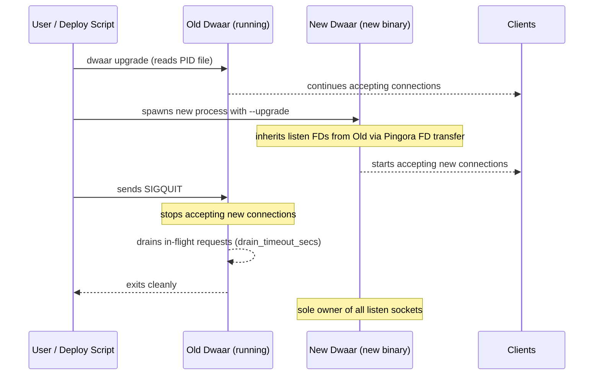

# Zero-Downtime Upgrades

Replace a running Dwaar binary without dropping a single connection. Dwaar uses Pingora's file-descriptor transfer mechanism: the new process inherits the listening sockets from the old one, starts accepting requests immediately, and the old process drains its in-flight connections before exiting.

This works at the OS level — no connection is reset, no client sees a TCP error, no request is lost.

## How It Works



The key property is that both processes share the listening sockets briefly during the handover. The kernel queues incoming connections on the shared socket; the new process services them. No `SO_REUSEPORT` race, no listen gap.

## CLI Commands

Trigger an upgrade with the `upgrade` subcommand:

```bash
# Upgrade using the current binary (replaces itself)
dwaar upgrade

# Upgrade to a specific new binary
dwaar upgrade --binary /usr/local/bin/dwaar-1.2.0

# Specify a non-default PID file location
dwaar upgrade --pid-file /run/dwaar/dwaar.pid
```

Pass `--upgrade` as a flag when you want to start a process that takes over from a running instance (this is what `dwaar upgrade` does internally):

```bash
dwaar --upgrade --config /etc/dwaar/Dwaarfile
```

| Flag / Subcommand | Purpose |
|---|---|
| `dwaar upgrade` | Orchestrates the full upgrade: starts new process, sends SIGQUIT to old |
| `--upgrade` | Tells the new process to inherit listening FDs from the old one |
| `--binary PATH` | Path to the new binary (default: current executable) |
| `--pid-file PATH` | Path to the PID file of the running instance (default: `/tmp/dwaar.pid`) |

## PID File

Dwaar writes a PID file when running in daemon mode (`--daemon`). The `upgrade` subcommand reads this file to find the old process.

Default location: `/tmp/dwaar.pid`

Configure a production path via the unit file or startup flags:

```bash
dwaar --daemon --config /etc/dwaar/Dwaarfile
# PID written to /tmp/dwaar.pid by default
```

When using systemd with `Type=simple` (no `--daemon`), set `PIDFile` in the unit file and use `$MAINPID` — systemd tracks the PID itself, so you can pass it explicitly:

```bash
# In ExecStart, write the PID manually if not using --daemon
ExecStart=/usr/local/bin/dwaar --config /etc/dwaar/Dwaarfile
```

For daemon mode in production:

```bash
ExecStart=/usr/local/bin/dwaar --daemon --config /etc/dwaar/Dwaarfile
PIDFile=/run/dwaar/dwaar.pid
```

The `upgrade` subcommand verifies the PID file before trusting it — it checks that the file is owned by the current user and is not world-writable, preventing privilege escalation via a tampered PID file.

## Connection Draining

After receiving SIGQUIT, the old process enters a drain phase:

- Stops calling `accept()` on all listening sockets.
- Waits for all in-flight HTTP requests to complete.
- Exits once the drain window closes or all connections finish, whichever comes first.

The drain window is controlled by `drain_timeout_secs` in your Dwaarfile:

```
options {
  drain_timeout_secs 30
}
```

| Value | Behaviour |
|---|---|
| Not set | Default 30 seconds |
| `0` | Drain immediately (may cut active long-poll or streaming responses) |
| `120` | Wait up to 2 minutes for long-running requests to finish |

Pingora also applies its own `grace_period_seconds` (5 s) and `graceful_shutdown_timeout_seconds` (5 s) on top of the drain window. In practice, connections that complete within `drain_timeout_secs` exit cleanly; connections still open at the deadline are closed.

Tune `drain_timeout_secs` to match your longest expected request duration. For APIs with short timeouts, 30 s is sufficient. For file uploads or long-poll endpoints, increase to 60–120 s.

## Step-by-Step

Follow these steps to perform a production upgrade:

1. Build or download the new binary.

   ```bash
   # Example: download to a staging path
   curl -Lo /usr/local/bin/dwaar-new https://releases.dwaar.dev/v1.2.0/dwaar-linux-amd64
   chmod +x /usr/local/bin/dwaar-new
   ```

2. Validate the new binary against the live config before touching the running process.

   ```bash
   /usr/local/bin/dwaar-new validate --config /etc/dwaar/Dwaarfile
   ```

3. Run the upgrade.

   ```bash
   dwaar upgrade --binary /usr/local/bin/dwaar-new --pid-file /run/dwaar/dwaar.pid
   ```

   You will see output similar to:

   ```
   upgrading dwaar (old PID: 12345)
   starting new process: /usr/local/bin/dwaar-new --upgrade --config /etc/dwaar/Dwaarfile
   new process started (PID: 12399)
   sending SIGQUIT to old process (PID: 12345)
   upgrade complete — old process will drain and exit
   ```

4. Verify (see next section).

5. If the new process fails to start, the old process continues running unaffected — the SIGQUIT is only sent after the new process passes the liveness poll.

6. Swap the binary symlink once satisfied.

   ```bash
   ln -sf /usr/local/bin/dwaar-new /usr/local/bin/dwaar
   ```

## Verification

Confirm the upgrade succeeded before removing the old binary.

Check the new PID is running and the version matches:

```bash
# Confirm new process is alive
ps aux | grep dwaar

# Check version
dwaar version
```

Check active routes via the admin API (available immediately after the new process starts):

```bash
dwaar routes
```

Check logs for the new process startup message:

```bash
journalctl -u dwaar -n 50
# Look for: "starting dwaar" with the new version
```

Check that the old process has exited:

```bash
# Old PID should be gone
kill -0 <old_pid> 2>&1
# Expected: "No such process"
```

Send a test request to confirm traffic is being served:

```bash
curl -sv https://yourdomain.example/ -o /dev/null
```

If the new process crashes immediately after launch (visible in `journalctl`), the old process is still running and serving traffic — SIGQUIT was not sent. Investigate the startup failure, fix it, and retry.

## Related

- [Systemd Service](./systemd.md) — running Dwaar as a managed systemd unit
- [Docker](./docker.md) — rolling updates in container environments
- [Timeouts](../reference/timeouts.md) — configuring `drain_timeout_secs` and connection timeouts
