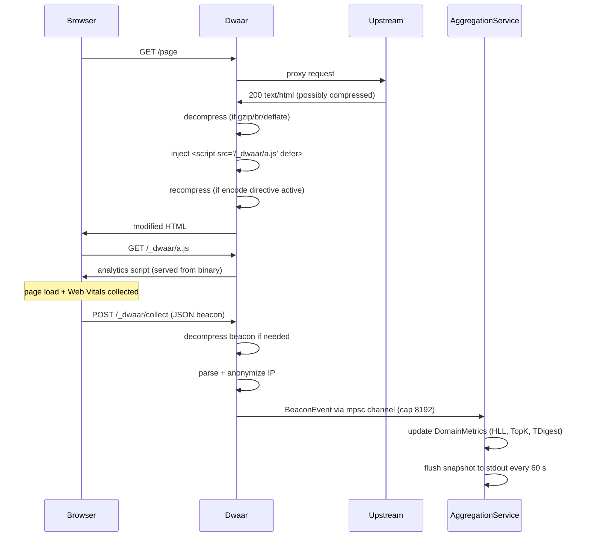

# First-Party Analytics

Dwaar ships a built-in analytics pipeline that is immune to ad blockers because
all traffic flows through the same origin. No third-party scripts, no cookies,
no tracking pixels. The JS beacon (`/_dwaar/a.js`, under 2.5 KB minified) is
injected automatically into every HTML response. Beacons POST back to
`/_dwaar/collect` — same domain, same TLS certificate — so browser privacy
modes and content-blocking extensions leave it alone.

In-memory aggregation uses space-efficient probabilistic structures: HyperLogLog
for unique visitor cardinality, a bounded TopK min-heap for pages and referrers,
and TDigest for Web Vitals percentiles. The total footprint is approximately
30 KB per tracked domain regardless of traffic volume.

## Quick Start

Analytics is enabled by default. Start Dwaar normally and every HTML response
served through the proxy will have the beacon script injected.

```
example.com {
    reverse_proxy localhost:3000
}
```

No Dwaarfile changes are required. Analytics can be disabled at process startup
with the `--no-analytics` flag:

```sh
dwaar run --no-analytics
```

## How It Works



The injector is a streaming state machine that scans response body chunks for
`</head>` (case-insensitive). It injects the `<script>` tag immediately before
the closing tag and transitions to pass-through mode for all remaining chunks.
The scan budget is 256 KB — responses with no `</head>` in the first 256 KB pass
through unmodified.

## What Gets Collected

| Metric | Data Structure | Memory | Description |
|---|---|---|---|
| Page views (last 1 min) | Ring buffer (60 buckets) | 480 B | Per-minute counters, stale buckets lazily zeroed |
| Page views (last 60 min) | Same ring buffer | — | Sum of up to 60 minute buckets |
| Unique visitors | HyperLogLog (2% error) | ~12 KB | Cardinality estimate from anonymized IPs |
| Top 100 pages | TopK min-heap | ~10 KB | Paths by view count, O(1) hot path |
| Top 50 referrers | BoundedCounter | ~5 KB | Referring domains extracted from Referer header |
| Top 250 countries | BoundedCounter | ~20 KB | Country codes from GeoIP (when enabled) |
| Status code distribution | `[u64; 6]` | 48 B | Bucketed: 1xx/2xx/3xx/4xx/5xx/other |
| Bytes transferred | `u64` counter | 8 B | Cumulative bytes sent to clients |
| LCP percentiles | TDigest (100 centroids) | ~1 KB | P50/P75/P95/P99, batched at 100 values |
| CLS percentiles | TDigest (100 centroids) | ~1 KB | Cumulative Layout Shift |
| INP percentiles | TDigest (100 centroids) | ~1 KB | Interaction to Next Paint |

**Total per domain:** ~30 KB, bounded. A server tracking 1000 domains uses
roughly 30 MB for analytics state.

Web Vitals are reported by the browser on page exit. LCP and INP are in
milliseconds; CLS is a unitless score. TDigest accuracy is within 5% at P99
for any sample size (verified by the test suite).

## Configuration

Analytics is on by default. The only configuration is the `encode` directive
interaction (see [Interaction with Compression](#interaction-with-compression))
and the `--no-analytics` CLI flag.

```sh
# Disable analytics entirely
dwaar run --no-analytics

# Disable everything (analytics, plugins, logging, GeoIP)
dwaar run --bare
```

When `--no-analytics` is set:

- The `/_dwaar/a.js` endpoint still serves the script (it is baked into the
  binary), but the beacon endpoint `/_dwaar/collect` returns 204 without
  enqueuing events.
- No `AggregationService` background task is registered.
- No `DashMap` is populated, so `GET /analytics` returns an empty array.

## Interaction with Compression

When `encode` is active and the upstream returns a compressed HTML response,
Dwaar runs this pipeline in order:

```
upstream chunk → decompress → inject /_dwaar/a.js → recompress → client
```

The decompressor supports gzip, deflate, and brotli. It buffers up to 10 MB of
compressed input per response and caps decompressed output at 100 MB to prevent
decompression bombs. On decompression failure the raw bytes pass through and
injection is skipped.

If the upstream response is already uncompressed and `encode` is active,
injection runs on the raw bytes and the compressor sees the modified HTML.
The `Content-Length` header is always removed when injection is active because
the injected script tag changes the body size.

## Accessing Analytics

The Admin API exposes analytics over HTTP. All analytics endpoints require the
`Authorization: Bearer <DWAAR_ADMIN_TOKEN>` header.

### List all domains

```http
GET /analytics
Authorization: Bearer <token>
```

Returns a JSON array of snapshots for every domain that has received traffic
since the process started.

```json
[
  {
    "domain": "example.com",
    "page_views_1m": 42,
    "page_views_60m": 1870,
    "unique_visitors": 318,
    "top_pages": [
      { "path": "/", "views": 940 },
      { "path": "/docs", "views": 412 }
    ],
    "referrers": [
      { "domain": "google.com", "count": 203 }
    ],
    "countries": [
      { "country": "US", "count": 512 }
    ],
    "status_codes": {
      "s1xx": 0, "s2xx": 1820, "s3xx": 30, "s4xx": 18, "s5xx": 2, "other": 0
    },
    "bytes_sent": 48302080,
    "web_vitals": {
      "lcp": { "p50": 1240.0, "p75": 1890.0, "p95": 3100.0, "p99": 4800.0 },
      "cls": { "p50": 0.02, "p75": 0.05, "p95": 0.12, "p99": 0.25 },
      "inp": { "p50": 80.0, "p75": 140.0, "p95": 320.0, "p99": 600.0 }
    },
    "timestamp": "2026-04-05T14:23:01Z"
  }
]
```

### Single domain

```http
GET /analytics/example.com
Authorization: Bearer <token>
```

Returns the same structure as a single object, or 404 if the domain has
received no traffic.

**Notes on freshness:**

- `page_views_1m` and `page_views_60m` reflect the live ring buffer and update
  on every request.
- `unique_visitors` is a HyperLogLog estimate with ±2% error.
- Web Vitals percentiles may lag by up to 100 observations because TDigest
  flushes in batches. Values are always consistent with the last completed batch.
- The full snapshot is flushed to stdout as newline-delimited JSON every 60
  seconds for log aggregation pipelines.

## Privacy

- **No cookies.** The analytics script does not set or read any cookies.
- **No fingerprinting.** Screen dimensions and browser language are collected
  for cohort analysis but not combined into a fingerprint identifier.
- **IP anonymization.** Client IPs are masked before being stored: IPv4
  addresses are truncated to `/24` (last octet zeroed); IPv6 addresses are
  truncated to `/48` (last 80 bits zeroed). The original IP is never persisted.
- **First-party only.** The beacon endpoint is `/_dwaar/collect` on the same
  origin as the page. No data leaves your infrastructure.
- **No cross-site tracking.** Each domain's `DomainMetrics` is isolated. There
  is no shared identifier across domains.

## Complete Example

```
example.com {
    reverse_proxy localhost:3000
    encode gzip zstd br
    tls auto
    header Strict-Transport-Security "max-age=31536000; includeSubDomains"
}

api.example.com {
    reverse_proxy localhost:4000
    encode gzip
}
```

Both sites have analytics enabled. `example.com` uses `encode` so Dwaar will
decompress, inject, and recompress HTML responses. The Admin API is configured
separately and is not part of the Dwaarfile.

## Related

- [Admin API](../reference/admin-api.md) — full endpoint reference including
  authentication and rate limiting
- [Prometheus Metrics](./prometheus.md) — request rate, error rate, and latency
  exported in Prometheus text format
- [Logging](./logging.md) — structured request logs (separate from analytics
  aggregation)
