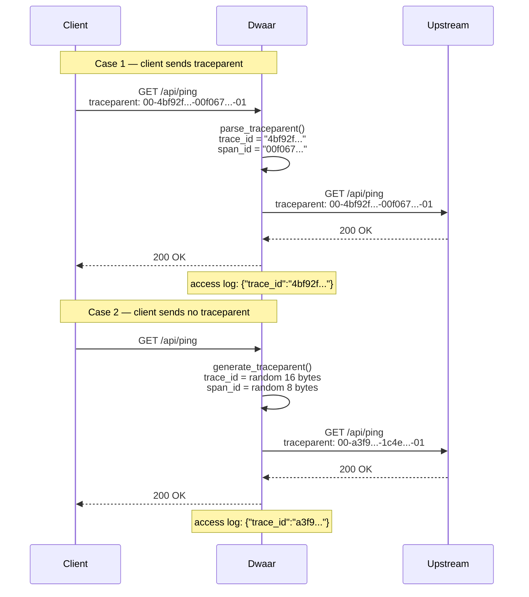

# Distributed Tracing

Dwaar implements W3C Trace Context propagation on every proxied request. Incoming requests that carry a valid `traceparent` header have their trace ID preserved and forwarded to the upstream. Requests with no header — or a malformed one — receive a freshly generated trace ID before the request reaches the upstream. The trace ID appears in every access log entry, linking Dwaar's logs to backend telemetry without any agent, sidecar, or configuration.

---

## Quick Start

No configuration is needed. Tracing is always active. To verify propagation, inspect the `traceparent` header your upstream receives:

```sh
# Send a request with an existing trace context
curl -H 'traceparent: 00-4bf92f3577b34da6a3ce929d0e0e4736-00f067aa0ba902b7-01' \
     https://example.com/api/ping

# Your upstream will receive the same traceparent header.
# The access log entry for this request will contain:
# "trace_id": "4bf92f3577b34da6a3ce929d0e0e4736"
```

---

## How It Works



Dwaar does not create child spans or emit span data to a collector. It operates as a transparent propagator: it reads, validates, and forwards the `traceparent` header, or generates one if none is present.

---

## W3C Trace Context

The `traceparent` header follows the [W3C Trace Context Level 1](https://www.w3.org/TR/trace-context/) specification:

```
traceparent: {version}-{trace-id}-{parent-id}-{trace-flags}
```

| Field | Length | Description |
|---|---|---|
| `version` | 2 hex chars | Always `00`. Dwaar rejects headers with any other version. |
| `trace-id` | 32 hex chars (16 bytes) | Identifies the entire distributed trace. Must not be all zeros. |
| `parent-id` | 16 hex chars (8 bytes) | Identifies the sending span. Must not be all zeros. |
| `trace-flags` | 2 hex chars | `01` = sampled, `00` = not sampled. Both are accepted. Generated headers always use `01`. |

**Example:**

```
traceparent: 00-4bf92f3577b34da6a3ce929d0e0e4736-00f067aa0ba902b7-01
               ^^ ^^^^^^^^^^^^^^^^^^^^^^^^^^^^^^^^ ^^^^^^^^^^^^^^^^ ^^
               |  trace-id (128 bit)               parent-id (64b)  flags
               version
```

Dwaar's parser rejects the following as malformed and generates a fresh context instead:

- Any value that does not split into exactly four dash-separated fields
- Version byte other than `00`
- `trace-id` or `parent-id` containing non-hex characters or wrong length
- All-zero `trace-id` (`00000000000000000000000000000000`)
- All-zero `parent-id` (`0000000000000000`)

Generated trace and span IDs use `fastrand` (thread-local PRNG, no syscall) for speed — uniqueness is the requirement, not cryptographic strength.

---

## Integration with Logging

Every access log entry written by Dwaar includes a `trace_id` field when tracing is active:

```json
{
  "timestamp": "2026-04-05T12:00:00.000Z",
  "method": "GET",
  "path": "/api/ping",
  "status": 200,
  "duration_ms": 4.2,
  "domain": "example.com",
  "trace_id": "4bf92f3577b34da6a3ce929d0e0e4736"
}
```

Use `trace_id` as a correlation key to join Dwaar's access log with your upstream application logs, structured log aggregators (Loki, Elasticsearch, Splunk), or APM trace views.

Filter all log entries belonging to a single trace:

```sh
# jq — filter a NDJSON log file by trace ID
jq 'select(.trace_id == "4bf92f3577b34da6a3ce929d0e0e4736")' /var/log/dwaar/access.log
```

---

## Integration with APM Tools

Because Dwaar propagates the standard `traceparent` header unchanged, any APM agent that instruments your upstream application automatically connects its spans to the same trace.

### Jaeger / OpenTelemetry

Configure your upstream service with an OpenTelemetry SDK. The SDK reads `traceparent` from incoming request headers and creates child spans under the same `trace-id`. Dwaar's access log `trace_id` field matches the trace visible in Jaeger's UI.

```
Dwaar access log: trace_id = 4bf92f3577b34da6a3ce929d0e0e4736
Jaeger trace ID:             4bf92f3577b34da6a3ce929d0e0e4736   ← identical
```

### Datadog

The Datadog tracing libraries (dd-trace) support W3C Trace Context in addition to Datadog's native `x-datadog-trace-id` header. Enable W3C propagation in your upstream:

```python
# Python example — ddtrace
from ddtrace.propagation.http import HTTPPropagator
# ddtrace reads traceparent automatically when
# DD_TRACE_PROPAGATION_STYLE=tracecontext is set.
```

Datadog converts the 128-bit W3C `trace-id` to its internal 64-bit ID for display; the last 16 hex characters of Dwaar's `trace_id` correspond to the Datadog trace ID.

### New Relic / Dynatrace

Both New Relic and Dynatrace support W3C Trace Context natively. Instrument your upstream application with the respective agent — no additional gateway configuration is required. The `trace_id` logged by Dwaar will appear as the root span's trace ID in your APM view.

### Custom correlation

If your backend does not use a supported APM agent, read the `traceparent` header directly and log it alongside your application events:

```go
// Go — extract trace ID from the forwarded header
tp := r.Header.Get("traceparent")
// tp == "00-4bf92f3577b34da6a3ce929d0e0e4736-00f067aa0ba902b7-01"
traceID := strings.Split(tp, "-")[1]  // "4bf92f3577b34da6a3ce929d0e0e4736"
```

---

## Related

- [Logging](logging.md) — full reference for the access log schema, including the `trace_id` field
- [Prometheus Metrics](prometheus.md) — request counters and latency histograms scraped from the admin API
