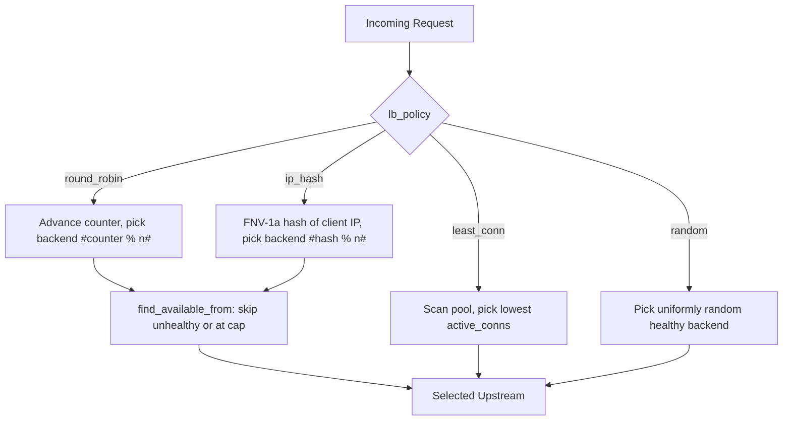

# Load Balancing

When a `reverse_proxy` block lists more than one upstream, Dwaar selects a backend on every request using a configurable policy. All selection logic is lock-free: health flags and connection counters are atomics, so there is no mutex on the hot path.

When every backend in a pool is either unhealthy or at its connection limit, Dwaar returns `502 Bad Gateway`.

---

## Quick Start

```txt
api.example.com {
    reverse_proxy {
        to backend1:8080 backend2:8080
        lb_policy round_robin
    }
}
```

---

## Policies



| Policy | Description | Best For |
|---|---|---|
| `round_robin` | Distributes requests evenly in turn across all healthy backends. Uses a single `AtomicU64` counter; no per-backend state. Default when `lb_policy` is omitted. | General-purpose. Equal-weight stateless backends. |
| `least_conn` | Scans the pool and selects the backend with the fewest in-flight connections (`active_conns`). O(n) scan; fine for pools under ~32 backends. | Long-lived or variable-latency requests (streaming, uploads). |
| `random` | Picks a uniformly random healthy backend using `fastrand`. No shared mutable state at all. | Large pools where counter contention matters. Stateless requests. |
| `ip_hash` | Hashes the client IP (FNV-1a over raw IP bytes) and maps it to a backend deterministically. Falls back to round-robin when no client IP is available. | Session affinity without sticky cookies. Cache-local workloads. |

### Single-Backend Fast Path

When a pool has exactly one backend, Dwaar skips the counter increment and the pool scan entirely. No policy overhead — just a health check and a `max_conns` check.

---

## Health-Aware Routing

All four policies exclude unhealthy backends from selection. When a policy's initial selection lands on an unhealthy or capped backend, Dwaar scans forward through the pool (wrapping around) until it finds one that is available.

```
round_robin / ip_hash selection walk:

  [backend0: unhealthy] → skip
  [backend1: at max_conns] → skip
  [backend2: healthy, under cap] → selected
```

`least_conn` and `random` filter the pool to healthy, under-cap backends before selecting, so they never land on an unavailable backend in the first pass.

### What Marks a Backend Unhealthy

A backend is marked unhealthy when:

- The background `HealthChecker` polls `health_uri` and receives a non-`2xx` response or a connection error.
- A connection attempt in `upstream_peer()` is refused (immediate mark, no waiting for the next health interval).

It is returned to the pool as soon as a subsequent health probe succeeds.

Configure health checking on the `reverse_proxy` block:

```txt
api.example.com {
    reverse_proxy {
        to app1:8080 app2:8080
        lb_policy round_robin
        health_uri /health
        health_interval 10
        fail_duration 30
    }
}
```

See [Reverse Proxy — Health Checks](../routing/reverse-proxy.md#health-checks) for full field details.

---

## Connection Limits

`max_conns` caps the number of concurrent in-flight connections to a single backend. The limit is enforced atomically using a compare-and-swap loop on `AtomicU32` — no mutex.

```txt
api.example.com {
    reverse_proxy {
        to app1:8080 app2:8080
        lb_policy least_conn
        max_conns 200
    }
}
```

When `acquire_connection()` is called for a backend already at its cap, it returns `false`. The selection logic then moves to the next available backend. If all backends are at their caps, Dwaar returns `502`.

Connection counters are decremented via `release_connection()` at the end of each request, including on error paths, so the count stays accurate under failure.

| Scenario | Outcome |
|---|---|
| Backend under cap | `acquire_connection` succeeds; request proceeds. |
| Backend at cap, others available | Caller skips to the next backend in the selection walk. |
| All backends at cap | `select()` returns `None`; proxy returns 502. |
| `max_conns` not set | Unlimited connections; `acquire_connection` always succeeds. |

---

## Complete Example

Three-backend pool with IP-hash affinity, health checks, and per-backend connection limits.

```txt
app.example.com {
    reverse_proxy {
        to app1.internal:8080 app2.internal:8080 app3.internal:8080

        lb_policy ip_hash

        health_uri /healthz
        health_interval 10
        fail_duration 60

        max_conns 300
    }
}
```

Each client IP consistently lands on the same backend as long as that backend is healthy. If `app2` fails a health probe, its traffic is redistributed via the `find_available_from` walk — no operator intervention needed.

---

## Related

- [Reverse Proxy](../routing/reverse-proxy.md) — full directive reference including upstream TLS and scale-to-zero
- [Timeouts](timeouts.md) — header, body, and keep-alive timeout configuration
- [Performance](../performance/http3.md) — HTTP/3 and connection efficiency
