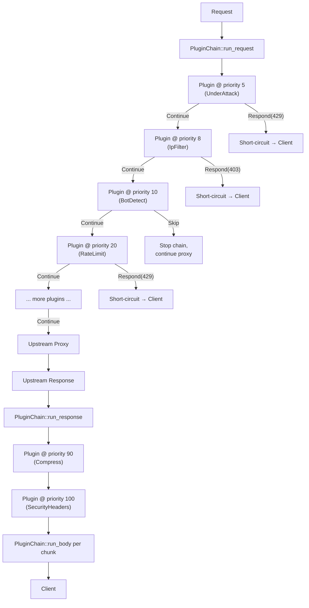

# Plugin System Overview

Dwaar's plugin system decouples optional features from the core proxy engine. Each feature — bot detection, rate limiting, compression, security headers, authentication — is a `DwaarPlugin` that hooks into three Pingora proxy phases. Plugins are composed into a `PluginChain`, sorted once by priority at startup, and reused lock-free across all worker threads for every request.

---

## How It Works



Request hooks run in ascending priority order. If any plugin returns `Respond`, the chain stops and that response is sent immediately — the upstream is never contacted. `Skip` stops the chain without sending a response. Response and body hooks always run in the same ascending order; they can modify headers and transform body chunks but cannot short-circuit (the response is already being built).

---

## DwaarPlugin Trait

```rust
pub trait DwaarPlugin: Send + Sync {
    /// Human-readable name for logging and diagnostics.
    fn name(&self) -> &'static str;

    /// Execution priority — lower values run first.
    fn priority(&self) -> u16;

    /// Called during `request_filter()`. Inspect request headers, populate
    /// context, or short-circuit with a response.
    fn on_request(&self, _req: &RequestHeader, _ctx: &mut PluginCtx) -> PluginAction {
        PluginAction::Continue
    }

    /// Called during `response_filter()`. Modify response headers or set
    /// up per-request state for body processing.
    fn on_response(&self, _resp: &mut ResponseHeader, _ctx: &mut PluginCtx) -> PluginAction {
        PluginAction::Continue
    }

    /// Called during `response_body_filter()` for each body chunk.
    /// Transform the body in-place (e.g., compression).
    fn on_body(
        &self,
        _body: &mut Option<Bytes>,
        _end_of_stream: bool,
        _ctx: &mut PluginCtx,
    ) -> PluginAction {
        PluginAction::Continue
    }
}
```

All hooks have default implementations that return `Continue`. Override only the hooks your plugin needs.

Hooks are **synchronous** — they run inline on Pingora's worker threads. Keep them fast. Use `BackgroundService` for any work that requires async I/O.

---

## PluginCtx

`PluginCtx` is per-request state shared across all plugins. The proxy engine populates it before the chain runs; plugins read and write it to communicate.

| Field | Type | Populated by | Description |
|-------|------|-------------|-------------|
| `client_ip` | `Option<IpAddr>` | proxy engine | Client TCP address |
| `host` | `Option<CompactString>` | proxy engine | `Host` header value |
| `method` | `CompactString` | proxy engine | HTTP method (`GET`, `POST`, …) |
| `path` | `CompactString` | proxy engine | Request path |
| `is_tls` | `bool` | proxy engine | `true` if the downstream connection used TLS |
| `accept_encoding` | `CompactString` | proxy engine | `Accept-Encoding` header value |
| `rate_limit_rps` | `Option<u32>` | proxy engine | Per-route requests-per-second limit; `None` means no limit |
| `route_domain` | `Option<CompactString>` | proxy engine | Canonical domain from matched route; used as rate-limiter key |
| `under_attack` | `bool` | proxy engine | `true` when Under Attack Mode is active for this route |
| `ip_filter` | `Option<Arc<IpFilterConfig>>` | proxy engine | Per-route IP filter config; `None` means no filtering |
| `is_bot` | `bool` | `BotDetectPlugin` | `true` when the client is a known bot |
| `bot_category` | `Option<BotCategory>` | `BotDetectPlugin` | Bot category (search, scraper, malicious, …) |
| `country` | `Option<CompactString>` | GeoIP / plugin | ISO 3166-1 alpha-2 country code |
| `compressor` | `Option<ResponseCompressor>` | `CompressPlugin` | Negotiated compression algorithm for this response |
| `rate_limited` | `bool` | `RateLimitPlugin` | `true` when this request was rejected by rate limiting |

String fields use `CompactString`, which stores up to 24 bytes inline with no heap allocation. HTTP methods, hostnames, country codes, and most header values fit inline.

---

## PluginAction

Every hook returns a `PluginAction` that tells the chain what to do next.

| Variant | Effect on `run_request` | Effect on `run_response` / `run_body` |
|---------|------------------------|---------------------------------------|
| `Continue` | Pass to the next plugin | Pass to the next plugin |
| `Respond(PluginResponse)` | Stop chain; send this response to the client | Stop chain; response already committed |
| `Skip` | Stop chain; continue normal proxy flow (no response sent) | Stop chain |

`PluginResponse` carries a status code (`u16`), a list of `(&'static str, String)` headers, and a `Bytes` body. Use it to return synthetic responses like `429 Too Many Requests` or `403 Forbidden`.

---

## Priority Ordering

Lower priority values run first. The built-in plugins are spaced to leave room for custom plugins at any point in the chain.

| Priority | Plugin | Phase(s) |
|----------|--------|----------|
| 5 | `UnderAttackPlugin` | request |
| 8 | `IpFilterPlugin` | request |
| 10 | `BotDetectPlugin` | request |
| 15 | `UnderAttackPlugin` (challenge check) | request |
| 20 | `RateLimitPlugin` | request |
| 90 | `CompressPlugin` | response, body |
| 100 | `SecurityHeadersPlugin` | response |

WASM plugins are assigned a priority at load time via the `priority` field in your `Dwaarfile` route block. Use any value in the gaps above to interleave native and WASM plugins.

---

## Built-in Plugins

| Plugin | Description | Doc |
|--------|-------------|-----|
| `UnderAttackPlugin` | Presents a JS challenge page when Under Attack Mode is active for a route | [native-plugins.md](native-plugins.md) |
| `IpFilterPlugin` | Allows or blocks requests based on per-route IP allowlists and denylists | [native-plugins.md](native-plugins.md) |
| `BotDetectPlugin` | Classifies clients by User-Agent into search, scraper, malicious, and human categories | [native-plugins.md](native-plugins.md) |
| `RateLimitPlugin` | Enforces per-route requests-per-second limits; applies stricter limits to bots | [native-plugins.md](native-plugins.md) |
| `CompressPlugin` | Negotiates and applies Brotli, Gzip, or Deflate compression for compressible responses | [native-plugins.md](native-plugins.md) |
| `SecurityHeadersPlugin` | Adds `X-Content-Type-Options`, `X-Frame-Options`, `Referrer-Policy`, and related security headers | [native-plugins.md](native-plugins.md) |

`BasicAuthConfig` and `ForwardAuthConfig` are route-level middleware that wrap into request-phase logic. They are not registered in the `PluginChain` but follow the same pattern of reading `PluginCtx` and returning early responses.

---

## Plugin Types

| Type | Language | Overhead | Isolation | Use case |
|------|----------|----------|-----------|----------|
| Native Rust | Rust | Zero — inline on the hot path | None (shares process) | High-throughput built-in features |
| WASM | Any `wasm32-wasip2` target | Wasmtime overhead per call | Full sandbox | Custom business logic, third-party extensions |

Native plugins are compiled into the Dwaar binary and share memory with the proxy engine. WASM plugins are loaded from `.wasm` files at startup, sandboxed by Wasmtime, and communicate with the host via a WIT-defined interface.

See [Native Plugin Development](native-plugins.md) and [WASM Plugins](wasm-plugins.md) for implementation guides.

---

## Related

- [Native Plugin Development](native-plugins.md) — implement `DwaarPlugin` in Rust
- [WASM Plugins](wasm-plugins.md) — write plugins in any `wasm32-wasip2` language
- [Security](../security/index.md) — IP filtering, rate limiting, and Under Attack Mode in context
