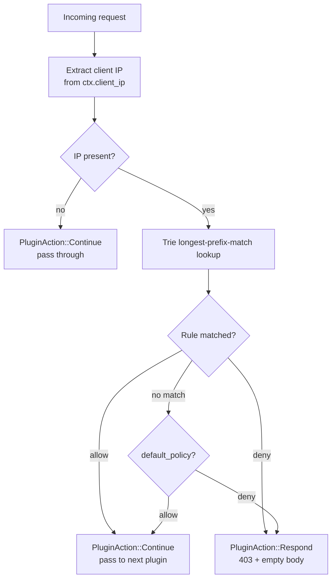

# IP Filtering

Per-route CIDR-based allowlist and blocklist. Rules are stored in a binary trie that delivers O(prefix-length) lookups regardless of how many rules you define — 5 rules and 50,000 rules cost the same number of bit comparisons. IPv4 and IPv6 addresses share a single trie; IPv4 addresses are normalised to their IPv4-mapped IPv6 form (`::ffff:x.x.x.x`) at insert and lookup time.

---

## Quick Start

```
admin.example.com {
    ip_filter {
        allow 10.0.0.0/8
        default deny
    }
    reverse_proxy localhost:8080
}
```

Only requests from the `10.0.0.0/8` range reach the upstream. Every other IP receives a `403 Forbidden` response with an empty body.

---

## How It Works



The plugin runs at **priority 8** — after Under Attack Mode (priority 5) but before bot detection (priority 10). Blocked IPs are rejected before any credential check, rate-limit counter increment, or upstream connection is made.

### Trie lookup semantics

The trie uses **longest-prefix-match**: when an IP matches multiple rules, the most specific (longest prefix) rule wins. A request from `10.0.1.50` with rules `allow 10.0.0.0/8` and `deny 10.0.1.0/24` is denied, because `/24` is more specific than `/8`.

When no rule matches, the `default` policy applies. Omitting `default` is equivalent to `default allow`.

---

## Configuration

```
ip_filter {
    allow  <cidr> ...
    deny   <cidr> ...
    default allow | deny
}
```

| Sub-directive | Values | Required | Description |
|---------------|--------|----------|-------------|
| `allow` | CIDR or bare IP | no | Add a rule that allows matching addresses. Repeat for multiple ranges. |
| `deny` | CIDR or bare IP | no | Add a rule that denies matching addresses. Repeat for multiple ranges. |
| `default` | `allow` or `deny` | no | Policy for IPs that match no rule. Defaults to `allow`. |

**CIDR notation:** Standard slash notation — `10.0.0.0/8`, `192.168.1.0/24`, `2001:db8::/32`. Bare IPs without a prefix length are treated as host routes (`/32` for IPv4, `/128` for IPv6).

**IPv4 and IPv6 coexist freely.** Mix `allow 10.0.0.0/8` (IPv4) and `deny 2001:db8::/32` (IPv6) in the same block without any special handling.

---

## Evaluation Order

The trie evaluates each request with these steps, in order:

1. Walk the trie from the root, following the bits of the client IP.
2. At each node that has an action attached, record that action as the current best match.
3. When the walk ends (at a leaf or because no child exists for the next bit), return the last recorded action.
4. If no action was recorded (no rule matched), apply the `default` policy.

**Longest prefix always wins.** There is no separate ordering between `allow` and `deny` rules — the specificity of the CIDR prefix is the only tiebreaker. A more specific deny beats a broader allow, and a more specific allow beats a broader deny.

| Scenario | Rules | Result for matching IP |
|----------|-------|------------------------|
| IP in allow range, no deny | `allow 10.0.0.0/8`, `default deny` | Allowed |
| IP in deny range, no allow | `deny 203.0.113.0/24`, `default allow` | Denied |
| IP in both; deny more specific | `allow 10.0.0.0/8`, `deny 10.0.1.0/24` | Denied (for `10.0.1.x`) |
| IP in both; allow more specific | `deny 10.0.0.0/8`, `allow 10.0.0.5` | Allowed (for `10.0.0.5` only) |
| No rule matches, `default allow` | `deny 203.0.113.0/24`, `default allow` | Allowed (all other IPs) |
| No rule matches, `default deny` | `allow 10.0.0.0/8`, `default deny` | Denied (all non-10.x IPs) |

---

## Complete Example

```
# Global config — automatic TLS
{
    email ops@example.com
}

# Public website — allow everyone, block known bad ranges
www.example.com {
    ip_filter {
        deny 203.0.113.0/24
        deny 198.51.100.0/24
        default allow
    }
    reverse_proxy localhost:3000
    rate_limit 500/s
}

# API — open access with one blocked range
api.example.com {
    handle /v1/* {
        ip_filter {
            deny 203.0.113.0/24
            default allow
        }
        reverse_proxy localhost:8080
        rate_limit 100/s
    }

    # Admin endpoints — allowlist only, then basic auth
    handle /admin/* {
        ip_filter {
            allow 10.0.0.0/8
            allow 192.168.0.0/16
            allow 2001:db8:office::/48
            default deny
        }
        basic_auth {
            admin $2b$12$examplehashgoeshere...............
        }
        reverse_proxy localhost:8080
        rate_limit 10/s
    }
}
```

In this setup:

- `www.example.com` is open to the public but blocks two known-bad subnets.
- `api.example.com /v1/*` is public except for one denied subnet.
- `api.example.com /admin/*` is restricted to internal RFC 1918 ranges and a specific IPv6 office prefix. Requests from outside those ranges receive `403` before the `basic_auth` check runs.

---

## Related

- [Rate Limiting](rate-limiting.md) — per-IP sliding-window limits, runs after IP filtering (priority 20)
- [Forward Auth](forward-auth.md) — delegate authentication decisions to an external service
- [Security Headers](security-headers.md) — add `Strict-Transport-Security`, CSP, and other response headers
