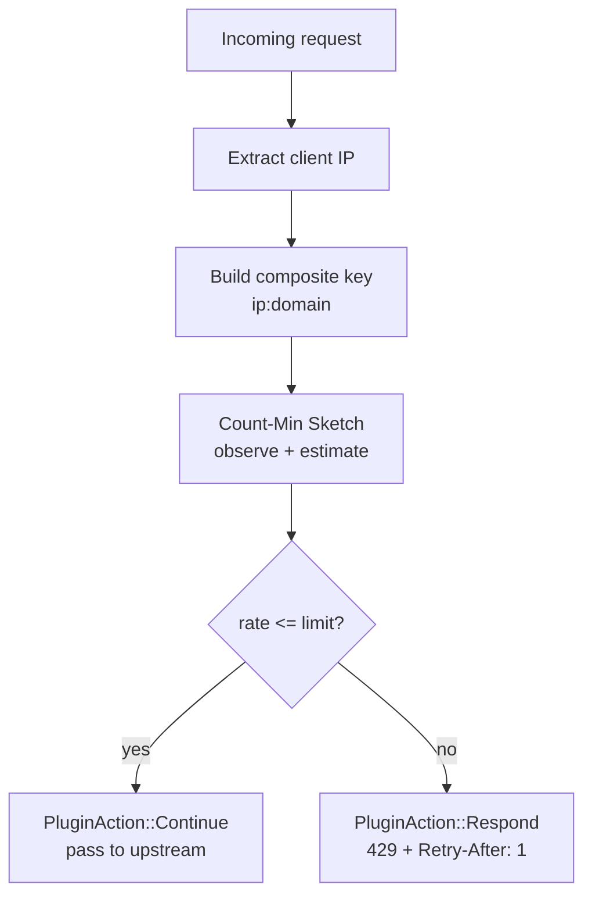

# Rate Limiting

Per-IP, per-route rate limiting using a Count-Min Sketch sliding-window estimator. The entire state fits in ~32 KB of memory, is fully thread-safe with no locks, and is enabled with a single directive in your Dwaarfile.

---

## Quick Start

```
api.example.com {
    reverse_proxy localhost:8080
    rate_limit 100/s
}
```

Every IP address is limited to 100 requests per second on `api.example.com`. Requests over the limit receive a `429 Too Many Requests` response immediately — no queuing, no delay.

---

## How It Works



### Sliding-window interpolation

The estimator uses a 1-second measurement window and the `PROPORTIONAL_RATE_ESTIMATE_CALC_FN` from `pingora-limits`. On every request, the plugin:

1. Records a count of 1 for the composite key.
2. Computes a weighted estimate that interpolates between the completed previous interval and the still-accumulating current interval, proportional to how far through the current second you are.

This avoids the step-function artifact of pure fixed windows: a burst of 200 requests at 00:00.999 and 200 more at 00:01.001 would not be rate-limited by a naive 1-second counter reset, but the sliding estimate sees ~400 rps and correctly rejects the excess.

### Composite key isolation

The key `{client_ip}:{route_domain}` gives each (IP, site) pair its own counter. A single IP accessing two different virtual hosts on the same Dwaar instance is tracked independently — reaching the limit on `api.example.com` does not affect the same IP's budget on `www.example.com`.

Keys up to 24 bytes are stored inline in a `CompactString` with no heap allocation. IPv4 + short domain names (e.g., `203.0.113.1:api.example.com` = 25 bytes) fall just over the inline threshold and allocate once per request; this is a single small allocation and does not affect throughput in any measurable way.

---

## Configuration

```
rate_limit <N>/<duration>
```

The rate is expressed as **N events per duration**. The duration accepts seconds (`s`), minutes (`m`), or hours (`h`). Examples:

| Expression | Meaning |
|---|---|
| `100/s` | 100 requests per second per IP |
| `5000/10m` | 5 000 requests per 10 minutes per IP |
| `10000/h` | 10 000 requests per hour per IP |

If the expression cannot be parsed, Dwaar refuses the config at load time with an `expected:` hint pointing at the canonical format — as of 0.2.2, `ParseErrorKind::InvalidValue` carries an `accepted_format: &'static str` field so the parser error line directly tells you what to write:

```
error: invalid value for directive 'rate_limit' at line 6 col 5
  got:      "100 per second"
  expected: N/duration, e.g., 100/s or 5000/10m
```

The same `expected:` hint applies to `request_body` (body-size) and `timeouts` directives — `100mb`, `5s`, `1h30m`, etc. — so parser errors on any size- or duration-valued directive point at the canonical format instead of just saying "invalid".

Place `rate_limit` inside any site block. It applies to all paths on that site. To apply different limits to different paths, use `handle` blocks:

```
api.example.com {
    handle /public/* {
        reverse_proxy localhost:8080
        rate_limit 1000/s
    }

    handle /admin/* {
        reverse_proxy localhost:8080
        rate_limit 10/s
    }
}
```

### Choosing a limit

Start with a limit that is comfortably above your 99th-percentile legitimate traffic rate for a single IP. Common starting points:

| Use case | Suggested limit |
|----------|----------------|
| Public API (authenticated) | `100/s` – `500/s` |
| Public API (unauthenticated) | `20/s` – `100/s` |
| Login / auth endpoints | `5/s` – `20/s` |
| Webhook receivers | `50/s` – `200/s` |
| Static asset CDN fallback | `500/s` – `2000/s` |

These are starting points. Tune against your actual traffic profile and check your analytics logs for false-positive 429s before tightening further.

---

## Under Attack Mode

Dwaar includes an Under Attack Mode plugin (`UnderAttackPlugin`, priority 15) for L7 DDoS mitigation. When enabled for a route, it intercepts every request from an unverified client and serves a JavaScript proof-of-work challenge page instead of forwarding to the upstream.

**How the challenge works:**

1. A client without a valid clearance cookie receives a `200` response containing an HTML page with embedded JavaScript.
2. The JavaScript computes SHA-256 hashes of `challenge || nonce` in a loop, incrementing the nonce until it finds a hash with 20 leading zero bits (~1 million iterations, ~200 ms on a modern browser).
3. Once solved, the browser redirects itself to the original URL with `_dwaar_solved=1`, the challenge value, and the winning nonce as query parameters.
4. Dwaar verifies the proof-of-work server-side and issues a signed `_dwaar_clearance` cookie (HMAC-SHA256 over timestamp and client IP, valid for 1 hour).
5. Subsequent requests that present a valid, unexpired clearance cookie pass through to the upstream without re-solving.

**Non-browser clients** (curl, scrapers, bots) cannot execute JavaScript and are permanently stuck on the challenge page. They never reach your upstream.

**Cookie security properties:**

- The HMAC binds the cookie to the client's IP address. A cookie stolen from one IP is rejected on any other IP.
- The timestamp prevents replay attacks after the TTL expires.
- Cookie verification uses constant-time comparison to eliminate timing side-channels.
- Cookies are issued with `HttpOnly; SameSite=Lax` and `Secure` when the connection is TLS.

> **Note:** Under Attack Mode is currently an internal/programmatic feature. There is no Dwaarfile directive to enable it — it must be activated via the Dwaar admin API or control plane integration. A `under_attack` Dwaarfile directive is planned for a future release.

---

## Response

When a request is rate-limited, the client receives:

```
HTTP/1.1 429 Too Many Requests
Retry-After: 1
Content-Length: 0
```

The body is empty. The `Retry-After: 1` header tells standards-compliant clients to wait at least one second before retrying — which corresponds to the estimator's 1-second window.

**What the client should do:**

- HTTP clients that respect `Retry-After` will wait 1 second automatically.
- Clients that hammer through 429s will continue to be rejected: the rate estimate includes the rejected requests.
- A 429 is not a ban. A client that drops its rate below the limit will immediately start receiving `200`s again on the next estimation window.

---

## Plugin Priority

As of 0.2.3, `RateLimitPlugin` runs at **priority 15** — **before** `UnderAttackPlugin` at priority 20. The order was inverted in previous releases, which meant that a request over the per-IP limit would still be handed an under-attack challenge page, burn a proof-of-work on the client, and then be rejected. That produced noisy user-facing failures under flood and gave attackers free compute on legitimate clients.

| Priority | Plugin | What it does |
|----------|--------|-------------|
| 10 | `BotDetectionPlugin` | Sets `ctx.is_bot` flag |
| **15** | **`RateLimitPlugin`** | **Per-IP sliding-window limit — runs first** |
| 20 | `UnderAttackPlugin` | JS proof-of-work challenge (only for requests the rate limiter allowed through) |
| 30+ | Other plugins | Auth, headers, etc. |

Running after bot detection (priority 10) means the rate limiter can see `ctx.is_bot` if you build custom logic on top of the plugin chain. It runs before forward auth and other higher-priority plugins so that rate-limited requests are rejected before any upstream credential checks are made.

### IPv4-mapped IPv6 normalization (0.2.3)

Rate-limit keys now canonicalize the client IP through `Ipv6Addr::to_canonical()` before they are inserted into the Count-Min Sketch. In practice this means `::ffff:127.0.0.1` (IPv4-mapped IPv6) and `127.0.0.1` produce the **same** composite key for the same route.

Before 0.2.3, a dual-stack listener could accept the same client under two distinct keys, so an attacker straddling the mapping could effectively double their per-IP budget by toggling address families between requests. The canonicalization step eliminates that drift.

The change is transparent to the Dwaarfile — no directive, no opt-in.

---

## Memory Usage

The estimator allocates a fixed `4 hashes × 1024 slots = 4096 counters` table at startup. Each counter is an atomic value (8 bytes), giving:

```
4 × 1024 × 8 bytes = 32,768 bytes ≈ 32 KB
```

This is the **total memory cost** regardless of how many unique IPs are tracked. There is no per-IP allocation.

**Collision behaviour:** Count-Min Sketch is a probabilistic structure. With 1024 slots per hash row, collision rates remain low up to roughly 1000 distinct active keys. Above that threshold, estimates become slightly inflated — some IPs may be rate-limited slightly earlier than their true rate would warrant. No IP is ever permitted above the limit due to collisions; the sketch only over-counts, never under-counts.

For most deployments, 1000 simultaneously active IP:domain pairs per Dwaar worker is a generous ceiling. If your traffic profile regularly exceeds this (e.g., a very large public API), consider deploying multiple worker processes or increasing the sketch dimensions by modifying `RateLimiter::new()` to pass a custom `Rate` config.

---

## Complete Example

```
# Global TLS — Dwaar handles certificate provisioning
{
    email admin@example.com
}

# Public website — relaxed limit
www.example.com {
    reverse_proxy localhost:3000
    rate_limit 500/s

    header {
        Strict-Transport-Security "max-age=63072000; includeSubDomains; preload"
        X-Content-Type-Options nosniff
    }
}

# API — strict limit with per-path overrides
api.example.com {
    handle /v1/* {
        reverse_proxy localhost:8080
        rate_limit 100/s
    }

    handle /admin/* {
        ip_filter {
            allow 10.0.0.0/8
            allow 192.168.0.0/16
            default deny
        }
        reverse_proxy localhost:8080
        rate_limit 10/s
    }
}

# Login endpoint — aggressive rate limiting to slow credential stuffing
auth.example.com {
    handle /login {
        rate_limit 5/s
        reverse_proxy localhost:9000
    }

    handle {
        reverse_proxy localhost:9000
    }
}
```

---

## Related

- [Bot Detection](bot-detection.md) — classify traffic as bot or human before rate-limiting (priority 10)
- [IP Filtering](ip-filtering.md) — block or allow specific IP ranges outright
- [Security Headers](security-headers.md) — add `Strict-Transport-Security`, CSP, and other response headers
