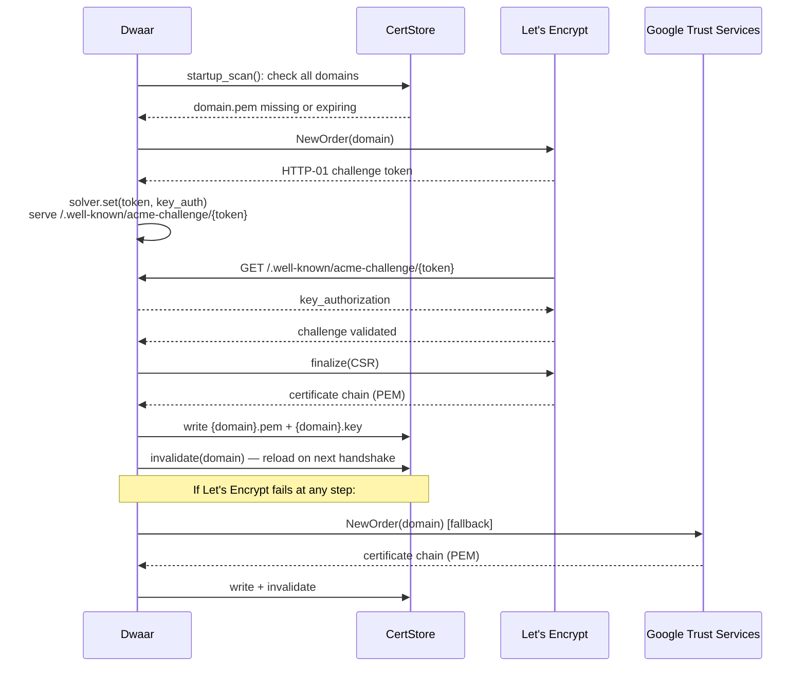
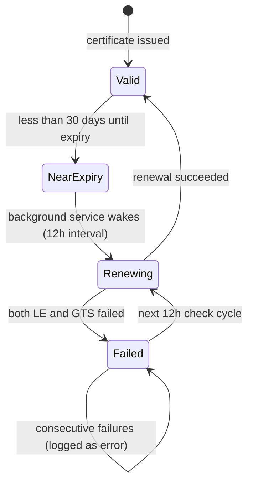

# Automatic HTTPS

Dwaar automatically provisions and renews TLS certificates via the ACME protocol. Point a domain's DNS at your server, add it to your Dwaarfile, and Dwaar handles the rest — no `certbot`, no cron jobs, no manual certificate management.

## Quick Start

```
example.com {
    reverse_proxy localhost:3000
}
```

That's the entire configuration. When Dwaar starts, it detects that `example.com` has no existing certificate, runs the ACME HTTP-01 challenge against Let's Encrypt, downloads the certificate, and begins serving HTTPS on port 443. Port 80 is kept open to redirect HTTP requests to HTTPS.

Two requirements for automatic provisioning to work:

1. The domain's DNS A/AAAA record must resolve to this server's public IP.
2. Port 80 must be reachable from the public internet (Let's Encrypt sends the HTTP-01 challenge over port 80).

## How It Works



The challenge token is served directly by Dwaar's request filter — no separate web server is needed. After validation completes, the token is cleaned up automatically.

Certificates use ECDSA P-256 keys and include a Subject Alternative Name (SAN) for the domain.

## ACME Providers

| Provider | Directory URL | Notes |
|---|---|---|
| Let's Encrypt (default) | `https://acme-v02.api.letsencrypt.org/directory` | Primary CA. Tried first for all domains. |
| Google Trust Services (fallback) | `https://dv.acme-v02.api.pki.goog/directory` | Automatic fallback if Let's Encrypt fails. No extra configuration required. |
| Let's Encrypt Staging | `https://acme-staging-v02.api.letsencrypt.org/directory` | Issues untrusted certs. Use for testing the provisioning flow without hitting rate limits. Enable with `DWAAR_ACME_STAGING=1`. |

Dwaar maintains separate ACME account credentials per CA under `{acme_dir}/{ca_id}.json`. Credentials are created on first use and reused on subsequent runs.

## Certificate Renewal



The `TlsBackgroundService` runs inside Dwaar's process as a Pingora background service. It wakes every **12 hours** to:

1. Refresh OCSP stapling responses for all cached certificates.
2. Check whether any certificate expires within **30 days**. If so, renew it immediately.

On startup, the service performs an immediate scan before entering the loop, so domains missing certificates are provisioned before traffic arrives.

A concurrency guard prevents double-issuance if a renewal is already in progress for a domain. Failed renewals are retried on the next 12-hour cycle — the existing (still-valid) certificate continues to serve traffic until renewal succeeds.

## Configuration

### Default behavior (no explicit `tls` directive needed)

```
example.com {
    reverse_proxy localhost:3000
}
```

Any domain block without a `tls` directive uses automatic HTTPS by default.

### Explicit `tls auto`

```
example.com {
    reverse_proxy localhost:3000
    tls auto
}
```

Identical to the default. Use this when you want to make the intent explicit in the Dwaarfile.

### ACME contact email

Add an email address to global options so Let's Encrypt can contact you about expiring certificates or policy changes:

```
{
    email admin@example.com
}

example.com {
    reverse_proxy localhost:3000
}
```

### Disable automatic HTTPS entirely

```
{
    auto_https off
}

example.com {
    reverse_proxy localhost:3000
}
```

All sites serve plain HTTP. No certificates are provisioned.

### Keep HTTPS but skip the HTTP→HTTPS redirect

```
{
    auto_https disable_redirects
}

example.com {
    reverse_proxy localhost:3000
}
```

Dwaar provisions certificates and serves HTTPS normally, but does not automatically redirect `http://example.com` to `https://example.com`. Use this if you manage HTTP traffic separately (e.g. load balancer in front that handles redirects).

### Disable TLS for a specific domain only

```
example.com {
    reverse_proxy localhost:3000
    tls off
}
```

That domain serves plain HTTP; all other domains in the same Dwaarfile continue to get certificates automatically.

## Certificate Storage

Certificates are stored in the configured certificate directory (default: `/etc/dwaar/certs/`).

| File | Permissions | Contents |
|---|---|---|
| `{domain}.pem` | `0644` | Full certificate chain in PEM format (leaf cert + issuer) |
| `{domain}.key` | `0600` | ECDSA P-256 private key in PKCS#8 PEM format |

Both files are written atomically via a temp file and `rename()` — a partial write never corrupts a serving certificate.

ACME account credentials are stored separately in the ACME directory (default: `/etc/dwaar/acme/`):

| File | Contents |
|---|---|
| `le.json` | Let's Encrypt account credentials |
| `gts.json` | Google Trust Services account credentials |

## SNI Resolution

On each TLS handshake, Dwaar reads the SNI hostname from the TLS `ClientHello` and selects the matching certificate using the following priority order:

1. **Explicit cert path** — from a `tls /cert.pem /key.pem` directive for that exact domain.
2. **Exact domain** — `{cert_dir}/{domain}.pem` + `{cert_dir}/{domain}.key`.
3. **Wildcard fallback** — strips the first label and checks `*.{rest}` (e.g. `api.example.com` falls back to `*.example.com`).
4. **Default domain** — used for connections that send no SNI (IP-based clients). The first TLS-enabled domain in the config serves as the default.

Parsed certificates are held in a bounded LRU cache. After a renewal, the old cache entry is evicted immediately so the next handshake picks up the new certificate without waiting for natural LRU expiry.

If a cached certificate carries an OCSP staple (refreshed every 12 hours), it is attached to the `ServerHello` during the handshake.

## Troubleshooting

### Challenge fails: `connection refused` or timeout

Let's Encrypt must reach `http://{domain}/.well-known/acme-challenge/{token}` on port 80. Check that:

- Port 80 is open in your firewall / security group.
- No other process (nginx, apache, existing Dwaar instance) is occupying port 80.
- The domain's DNS resolves to this server's IP. Use `dig +short example.com` to verify.

### `domain does not resolve to this server`

ACME validation is done by the CA's validation servers, not from your machine. If the DNS hasn't propagated yet, the challenge will fail. Wait for propagation and restart Dwaar, or use the Let's Encrypt Staging environment while testing (`DWAAR_ACME_STAGING=1`) to avoid burning rate limits.

### `AllCasFailed`: both Let's Encrypt and Google Trust Services failed

Check the error details in the logs (`dwaar --debug`). Common causes:

- Port 80 is blocked — the challenge token was set but the CA could not fetch it.
- The domain resolves to a private IP (RFC 1918) — Let's Encrypt does not issue for non-routable addresses.
- You have hit Let's Encrypt's [rate limits](https://letsencrypt.org/docs/rate-limits/) (5 duplicate certificates per week per domain). Use Staging to test, then switch to production.

### Certificate renewed but browser still sees the old cert

The LRU cache is invalidated immediately after a successful renewal. If you are seeing a stale cert, the most likely cause is a CDN or upstream TLS terminator caching the old certificate. Dwaar itself will serve the new cert on the next handshake.

### `corrupt cert PEM — needs re-issuance`

A certificate file on disk failed to parse. Dwaar logs a warning and automatically re-issues the certificate. If re-issuance also fails, check filesystem permissions on the cert directory.

## Related

- [DNS Challenge (Wildcards)](dns-challenge.md) — use DNS-01 to provision `*.example.com` certificates without exposing port 80
- [Manual Certificates](manual-certs.md) — bring your own cert and key files with `tls /cert.pem /key.pem`
- [Self-Signed Certificates](self-signed.md) — `tls internal` for local development
- [OCSP Stapling](ocsp-stapling.md) — how Dwaar fetches and staples OCSP responses
