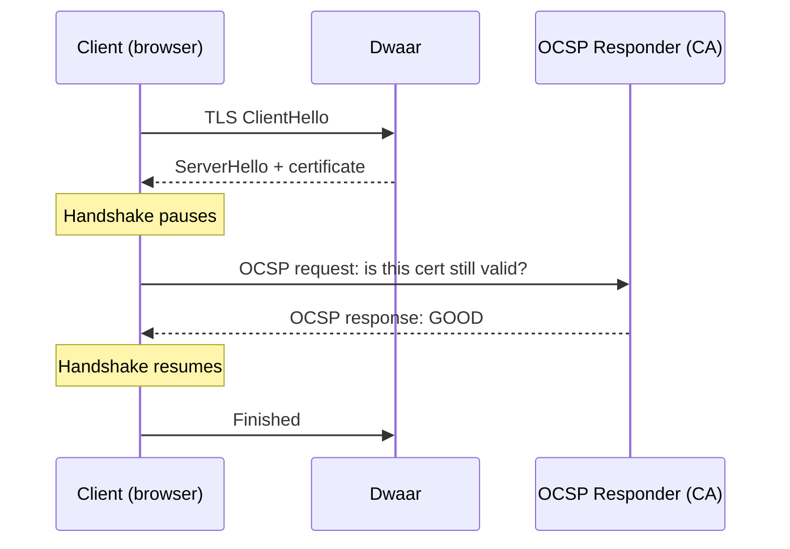
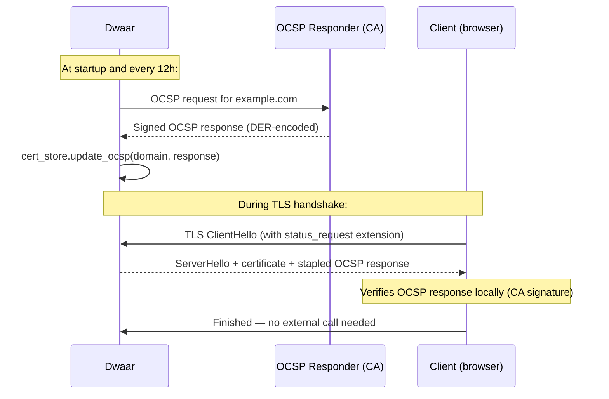

# OCSP Stapling

Dwaar proactively fetches OCSP (Online Certificate Status Protocol) responses from your certificate authority and staples them to TLS handshakes. Clients get proof that your certificate has not been revoked without making any external network request of their own.

## Quick Start

No configuration is needed. For any certificate that includes an OCSP responder URL — all ACME-provisioned certificates do — Dwaar fetches a fresh response at startup and refreshes it every 12 hours. The response is attached to every TLS handshake automatically.

```
example.com {
    reverse_proxy localhost:3000
}
```

That is all. OCSP stapling is active from the first handshake after startup.

## How It Works

### Without stapling



Every client contacts the CA's OCSP responder during the handshake. This adds a network round-trip that is beyond your control — if the OCSP responder is slow or unavailable, your clients' connections stall.

### With stapling (Dwaar's behavior)



Stapling is better in three ways:

| Property | Without Stapling | With Stapling |
|---|---|---|
| **Privacy** | CA learns client IP when it checks revocation | CA sees only Dwaar's IP (once per refresh cycle) |
| **Speed** | Client makes a synchronous network request during handshake | No extra round-trip — OCSP response is in the ServerHello |
| **Reliability** | Handshake can stall if OCSP responder is slow or down | Dwaar serves the cached response; CA availability doesn't affect handshake latency |

The stapled response is cryptographically signed by the CA, so clients can verify its authenticity without contacting the CA directly.

## Refresh Cycle

The `TlsBackgroundService` manages OCSP responses as part of the same 12-hour loop that handles certificate renewal.

```
Startup:
  1. Provision any missing or expiring certificates (ACME)
  2. Fetch OCSP responses for all domains with a full certificate chain

Every 12 hours:
  1. Fetch fresh OCSP responses for all domains
  2. Check for certificates expiring within 30 days and renew them
```

Domains are processed sequentially with a 1-second delay between each to avoid thundering-herd requests to the CA's OCSP responder.

### What happens on failure

| Failure mode | Behavior |
|---|---|
| OCSP responder unreachable or slow (10s timeout) | Warning logged; previous cached response continues to be stapled |
| OCSP response indicates certificate revoked | Error logged; the cached entry and on-disk PEM/key files are deleted and the ACME service re-issues a fresh certificate (see [Revocation handling](automatic-https.md#revocation-handling-023)) |
| OCSP responder URL resolves to a private, loopback, link-local, ULA, broadcast, multicast, unspecified, or metadata-service address | Request refused before the HTTP call — stapling is left unchanged for this refresh cycle (see [Responder address blocklist](#responder-address-blocklist-023)) |
| Cached OCSP response is older than 7 days | Stale response is **not** stapled; the handshake still succeeds, the client falls back to fetching OCSP itself |
| Certificate has no OCSP responder URL (e.g. `tls internal`) | Silently skipped — no OCSP for self-signed certs |
| Certificate chain has no issuer (single-cert PEM, no CA chain) | Silently skipped — issuer is required to build the OCSP request |

OCSP responses are valid for roughly 24 hours as issued by Let's Encrypt and Google Trust Services. A 12-hour refresh cycle ensures the stapled response is always current when it reaches clients.

### Staleness guard (0.2.3)

`CachedCert` now tracks the timestamp of the last successful OCSP refresh in `ocsp_last_refresh`. When the TLS callback builds a `ServerHello`, it compares that timestamp against the current time and suppresses the stapled response if it is older than **7 days**.

The handshake still completes normally — the client simply sees a response without a stapled OCSP extension and falls back to its own revocation check (soft-fail in most modern browsers, AIA fetch in older clients). This is deliberately more conservative than the formal OCSP response validity window: if Dwaar cannot reach the responder for a full week, the cached response is treated as untrustworthy and dropped from the handshake rather than quietly served past its useful life.

Operators see a matching `warn!` entry in the log when a stale response is suppressed. Resolving the underlying fetch failure (network, firewall, CA outage) restores stapling on the next successful refresh.

### Responder address blocklist (0.2.3)

Before dispatching an OCSP request, `http_post_ocsp` resolves the AIA-extracted responder host and rejects any address that falls into one of the following categories:

| Category | IPv4 | IPv6 |
|---|---|---|
| Loopback | `127.0.0.0/8` | `::1/128` |
| Private | `10/8`, `172.16/12`, `192.168/16` | — |
| Unique local (ULA) | — | `fc00::/7` |
| Link-local | `169.254/16` | `fe80::/10` |
| Broadcast / multicast / unspecified | `255.255.255.255`, `224/4`, `0.0.0.0` | `ff00::/8`, `::` |
| Cloud metadata service | `169.254.169.254` | — |

Non-HTTP(S) URI schemes are also refused per [RFC 6960 §A.1](https://datatracker.ietf.org/doc/html/rfc6960#appendix-A.1).

The blocklist is enforced **after** DNS resolution, so an AIA record that claims a public hostname but resolves to a private IP (DNS rebinding / internal split-horizon) is still blocked. This prevents a malicious or compromised CA from steering OCSP traffic at internal services — closing a server-side request forgery (SSRF) vector that existed in every OCSP-stapling proxy that trusted responder URIs verbatim.

The request budget, timeouts, and retry policy are unchanged; only the target address validation is new.

### OCSP response storage

The fetched DER-encoded OCSP response is stored in the in-memory `CertStore` alongside the certificate and key. The cache entry is updated using `peek_mut()` — the update does not change the entry's position in the LRU order, so background OCSP refreshes do not interfere with the eviction policy driven by actual handshake traffic.

## Configuration

OCSP stapling requires no configuration. It applies automatically to any certificate that:

1. Has an OCSP responder URL in the certificate's Authority Information Access (AIA) extension.
2. Was loaded with its full certificate chain (leaf cert + issuer concatenated in the PEM file).

Both conditions are satisfied automatically for ACME-provisioned certificates. For manual certificates (`tls /cert.pem /key.pem`), concatenate the issuer certificate into the same PEM file:

```sh
cat domain.pem issuer-ca.pem > /etc/dwaar/certs/example.com.pem
```

Dwaar parses the first certificate in the file as the leaf and the second as the issuer. If only one certificate is present, OCSP is skipped with a debug-level log entry.

## Complete Example

OCSP stapling works with any TLS setup. No special directive is needed:

```
# ACME cert — OCSP stapling automatic
example.com {
    reverse_proxy localhost:3000
}

# Manual cert — OCSP stapling active if /etc/dwaar/certs/api.example.com.pem
# contains the full chain (leaf + issuer)
api.example.com {
    reverse_proxy localhost:8080
    tls /etc/dwaar/certs/api.example.com.pem /etc/dwaar/certs/api.example.com.key
}

# Self-signed cert — OCSP not applicable, silently skipped
localhost {
    reverse_proxy localhost:3000
    tls internal
}
```

To confirm stapling is working, use `openssl s_client`:

```sh
openssl s_client -connect example.com:443 -status -servername example.com </dev/null 2>/dev/null \
  | grep -A 20 "OCSP response"
```

A working staple shows `OCSP Response Status: successful (0x0)` and `Cert Status: good`.

## Related

- [Automatic HTTPS](automatic-https.md) — ACME provisioning that enables OCSP stapling automatically
- [Manual Certificates](manual-certs.md) — how to supply a full certificate chain for stapling with `tls /cert.pem /key.pem`
